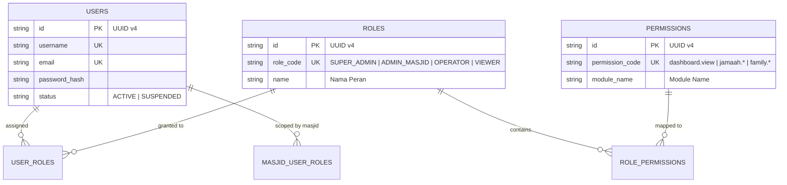

# Authorization & RBAC Domain RC1

Dokumen ini mendokumentasikan spesifikasi teknis fondasi **Domain Authorization & RBAC RC1** pada **MasjidCMS Platform v1.0**.

---

## 1. ER Diagram

---

## 2. Component Structure

- **`AuthorizationService`:** Implements `PermissionProviderInterface` for role & permission evaluation.
- **`PolicyResolver`:** Evaluates policy methods (`viewAny`, `view`, `create`, `update`, `delete`, `approve`).
- **`GuardResolver`:** Resolves identity via Session Guard or Bearer Token Guard.
- **`AuthorizationFilter`:** CI4 HTTP route filter evaluating user permissions.
