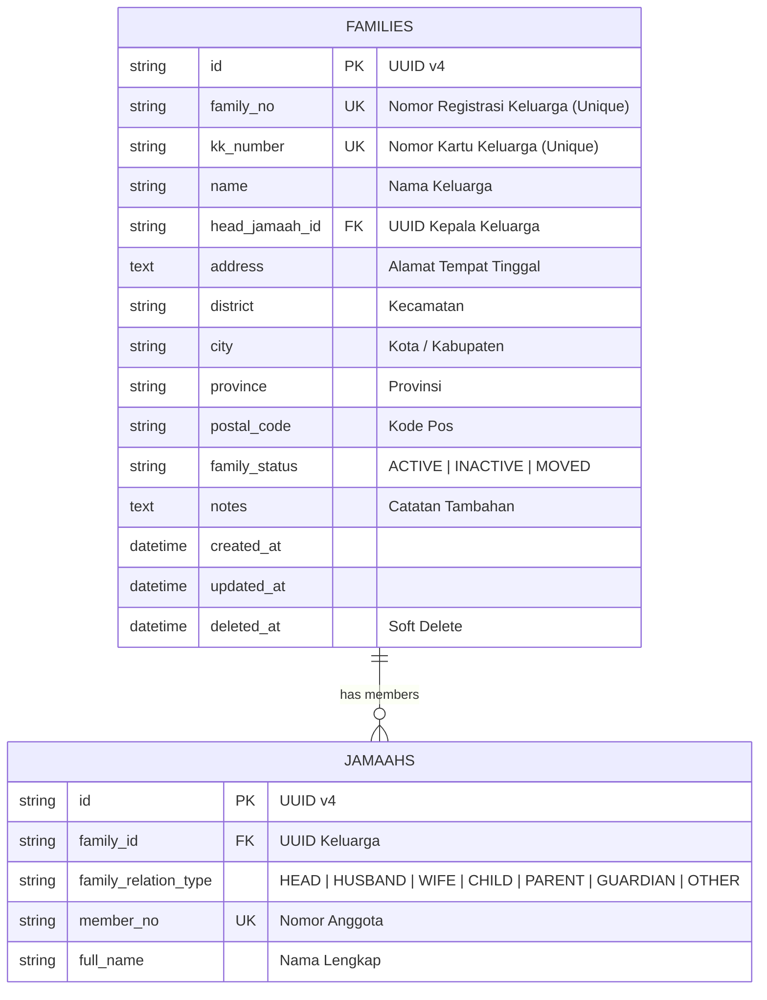

# Family Business Module RC1 — Domain Documentation

Dokumen ini mendokumentasikan spesifikasi teknis, skema data, ER diagram, alur bisnis, dan daftar REST endpoint untuk **Modul Keluarga RC1** pada **MasjidCMS Platform v1.0**.

---

## 1. Domain Architecture & ER Diagram

---

## 2. REST API Endpoints Specification

| Method | Endpoint | Description |
| :--- | :--- | :--- |
| `GET` | `/family` | Menampilkan daftar keluarga (Paginasi, Search, Filter, Sort) |
| `GET` | `/family/{id}` | Menampilkan detail keluarga berdasarkan UUID |
| `POST` | `/family` | Membuat Kartu Keluarga baru & menunjuk Kepala Keluarga |
| `PUT` | `/family/{id}` | Memperbarui data keluarga |
| `DELETE` | `/family/{id}` | Menghapus keluarga (Soft Delete) |
| `GET` | `/family/{id}/members` | Menampilkan seluruh jamaah anggota keluarga |
| `POST` | `/family/{id}/transfer-head` | Memindahkan peran Kepala Keluarga ke anggota lain |
