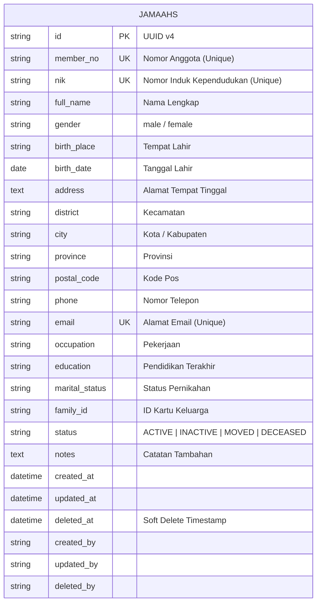

# Jamaah Business Module RC1 — Domain Documentation

Dokumen ini mendokumentasikan spesifikasi teknis, skema data, diagram ER, alur bisnis, dan daftar REST endpoint untuk **Modul Jamaah RC1** pada **MasjidCMS Platform v1.0**.

---

## 1. Domain Architecture & ER Diagram

Modul Jamaah terisolasi secara mandiri di bawah namespace `App\Domains\Jamaah`.



---

## 2. Business Flow & Lifecycle

```
[ Request Client ] ──► JamaahController ──► DTO Parsing
                                               │
                                               ▼
                                  JamaahService::create(data)
                                               │
                                               ▼
                                 validateCreate() [BEFORE Tx]
                         (Validasi Unique member_no, nik, email & status)
                                               │
                                               ▼
                                    TransactionManager::begin()
                                               │
                                               ▼
                                    Generate UUID v4 for Primary ID
                                               │
                                               ▼
                                    JamaahRepository::create()
                                               │
                                               ▼
                                    TransactionManager::commit()
                                               │
                                               ▼
                                    EntityCreatedEvent dispatched
                                               │
                                               ▼
                                    AuditEventListener Logs Entry
                                               │
                                               ▼
                                    ResponseFormatter (HTTP 201)
```

---

## 3. REST API Endpoint Specification

| Method | Endpoint | Query Parameters / Payload | Description |
| :--- | :--- | :--- | :--- |
| `GET` | `/jamaah` | `search`, `status`, `gender`, `city`, `district`, `sort_by`, `sort_order`, `page`, `per_page` | Menampilkan daftar jamaah (Paginasi, Search, Filter, Sort) |
| `GET` | `/jamaah/{id}` | - | Menampilkan detail data jamaah berdasarkan UUID |
| `POST` | `/jamaah` | JSON Payload (`member_no`, `nik`, `full_name`, `gender`, `phone`, `email`, dll.) | Mendaftarkan jamaah baru |
| `PUT` | `/jamaah/{id}` | JSON Payload (`full_name`, `status`, `address`, dll.) | Memperbarui data profil jamaah |
| `DELETE` | `/jamaah/{id}` | - | Menghapus data jamaah (Soft Delete) |

---

## 4. Search, Filter, & Sort Usage Examples

### 4.1 Pencarian Multi-Kolom (`search`)
Mencari frasa di kolom `member_no`, `nik`, `full_name`, `phone`, atau `email`:
```http
GET /jamaah?search=Ahmad
```

### 4.2 Penyaringan Kriteria (`filter`)
Menyaring jamaah yang aktif dan berdomisili di Kota Bogor:
```http
GET /jamaah?status=ACTIVE&city=Kota+Bogor&gender=male
```

### 4.3 Pengurutan Data (`sort`)
Mengurutkan jamaah berdasarkan nama secara alfabetis (A-Z):
```http
GET /jamaah?sort_by=full_name&sort_order=ASC
```
