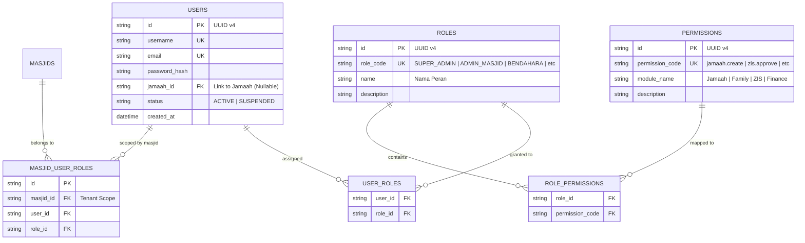
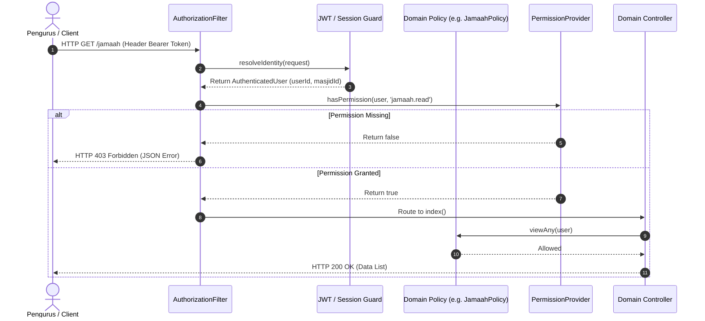

# MasjidCMS — Authorization & RBAC Product Analysis

**Versi:** 1.0 (Authorization & RBAC Architectural Specification)  
**Status:** APPROVED ARCHITECTURE SPECIFICATION  
**Fase:** Product Development RC1  
**Tanggal:** 27 Juli 2026  
**Penulis:** Lead Software Architect & Security Analyst  

---

## Executive Summary

Dokumen ini mendokumentasikan analisis menyeluruh untuk **Sistem Otorisasi dan Role-Based Access Control (RBAC)** pada **MasjidCMS Platform**.

Sistem otorisasi MasjidCMS dirancang untuk mendukung hirarki peran pengurus masjid yang kompleks, pengisolasian data antar-masjid (*multi-masjid tenant scope*), kontrol kepemilikan data (*resource ownership*), serta penegakan hak akses yang deklaratif tanpa merusak keutuhan Core Platform maupun modul-modul bisnis terpasang.

---

## 1. Role Hierarchy (Hirarki Peran)

Sistem mengadopsi struktur hirarki peran berjenjang (*Inherited Role Hierarchy*) yang merefleksikan struktur organisasi Takmir / DKM Masjid Indonesia:

```
                          ┌───────────────────────────┐
                          │        SUPER ADMIN        │ (Platform-Wide)
                          └─────────────┬─────────────┘
                                        │
                          ┌─────────────▼─────────────┐
                          │       ADMIN MASJID        │ (Tenant Admin)
                          └─────────────┬─────────────┘
                                        │
           ┌────────────────────────────┼────────────────────────────┐
           │                            │                            │
 ┌─────────▼─────────┐        ┌─────────▼─────────┐        ┌─────────▼─────────┐
 │     KETUA DKM     │        │    BENDAHARA      │        │    SEKRETARIS     │
 └─────────┬─────────┘        └─────────┬─────────┘        └─────────┬─────────┘
           │                            │                            │
 ┌─────────▼─────────┐        ┌─────────▼─────────┐        ┌─────────▼─────────┐
 │     OPERATOR      │        │   PETUGAS UPZ     │        │  PANITIA QURBAN   │
 └─────────┬─────────┘        └───────────────────┘        └───────────────────┘
           │
 ┌─────────▼─────────┐
 │ GURU TPQ / IMAM / │
 │     MUADZIN       │
 └─────────┬─────────┘
           │
 ┌─────────▼─────────┐
 │  JAMAAH / VIEWER  │ (Public / Read Only)
 └───────────────────┘
```

### Rincian Peran & Tanggung Jawab:

1. `SUPER_ADMIN`: Akses penuh lintas masjid, manajemen lisensi platform, dan audit global.
2. `ADMIN_MASJID`: Pengelola tertinggi di tingkat satu masjid (manajemen user, role assignment, konfigurasi masjid).
3. `KETUA_DKM`: Pengawas operasional masjid (approval keuangan besar, approval laporan publik, manajemen kebijakan).
4. `SEKRETARIS`: Pengelola administrasi, persuratan, pendataan Jamaah, dan jadwal Kajian.
5. `BENDAHARA`: Pengelola arus kas, transaksi ZIS (Zakat, Infaq, Shadaqah), laporan keuangan, dan anggaran Qurban.
6. `OPERATOR`: Petugas entri data harian (input jamaah, inventaris, pemasukan kotakan).
7. `UPZ_OFFICER`: Petugas Unit Pengumpul Zakat (input zakat fitrah, mal, pendataan mustahik & muzakki).
8. `QURBAN_OFFICER`: Panitia khusus operasional Qurban (pendaftaran mudi, penerimaan hewan, distribusi daging).
9. `TEACHER_TPQ`: Pengajar Taman Pendidikan Al-Qur'an (absensi & nilai santri).
10. `IMAM_MUADZIN`: Petugas peribadatan (jadwal piket & laporan kegiatan ibadah).
11. `JAMAAH_USER`: Akun Jamaah terverifikasi (melihat status iuran/zakat pribadi, data keluarga mandiri).
12. `VIEWER`: Akses baca umum (jadwal sholat, transparansi kas publik, informasi kajian).

---

## 2. Permission Matrix (Matriks Hak Akses)

Matriks hak akses didefinisikan secara granular berbasis tindakan (*Action-based Permissions*):

| Modul / Domain | Action Category | Permissions (`domain.action`) | Super Admin | Admin Masjid | Ketua DKM | Bendahara | Sekretaris | Operator | UPZ / Qurban | Jamaah / Viewer |
| :--- | :--- | :--- | :---: | :---: | :---: | :---: | :---: | :---: | :---: | :---: |
| **Masjid Domain** | Manage Config | `masjid.manage`, `masjid.config` | **Full** | **Full** | Read/Approve | Read | Read | Read | Read | Read |
| **Jamaah Domain** | CRUD & Export | `jamaah.create`, `jamaah.read`, `jamaah.update`, `jamaah.delete`, `jamaah.export` | **Full** | **Full** | Read | Read | **Full** | CRUD | Read | Self Only |
| **Family Domain** | CRUD & Transfer | `family.create`, `family.read`, `family.update`, `family.delete`, `family.transfer_head` | **Full** | **Full** | Read | Read | **Full** | CRUD | Read | Self Only |
| **ZIS Domain** | Transactions | `zis.collect`, `zis.distribute`, `zis.approve`, `zis.report` | **Full** | **Full** | Approve | **Full** | Read | Collect | **Full** (UPZ) | Read |
| **Qurban Domain** | Operasional | `qurban.register`, `qurban.distribute`, `qurban.report` | **Full** | **Full** | Read | Read | Read | Input | **Full** (Qurban) | Read |
| **Keuangan** | Financials | `finance.create`, `finance.approve`, `finance.report` | **Full** | **Full** | Approve | **Full** | Read | Input | Read | Read |
| **Inventaris** | Assets | `inventory.create`, `inventory.update`, `inventory.delete` | **Full** | **Full** | Read | Read | Read | **Full** | Read | Read |
| **System Audit** | Security Log | `audit.view`, `audit.export` | **Full** | **Full** | Read | Read | Read | None | None | None |

---

## 3. Resource Ownership & Multi-Tenancy

Setiap data di dalam MasjidCMS memiliki batas kepemilikan (*Ownership Boundary*):

1. **Tenant Ownership (`masjid_id`):**
    Seluruh tabel domain bisnis wajib memiliki korelasi `masjid_id`. Pengurus Masjid A **dilarang keras** membaca atau mengubah data milik Masjid B.
2. **Family Ownership (`family_id`):**
    Jamaah yang login sebagai `JAMAAH_USER` hanya diperbolehkan membaca data anggota keluarga mereka sendiri.
3. **Personal / Resource Self-Ownership (`created_by` / `jamaah_id`):**
    Pengguna individual hanya dapat mengubah profil atau melihat riwayat donasi milik mereka sendiri.

---

## 4. Scope Taxonomy (Cakupan Akses)

Pengawasan otorisasi dievaluasi berdasarkan 4 hirarki cakupan (*Scope*):

```
┌────────────────────────────────────────────────────────┐
│ 1. GLOBAL SCOPE     (Super Admin - Multi-Masjid)      │
├────────────────────────────────────────────────────────┤
│ 2. MASJID SCOPE     (Tenant Isolation - per masjid_id) │
├────────────────────────────────────────────────────────┤
│ 3. MODULE SCOPE     (Domain Level - ZIS, Jamaah, Kas)  │
├────────────────────────────────────────────────────────┤
│ 4. RESOURCE SCOPE   (Row Level / Owner Self Check)     │
└────────────────────────────────────────────────────────┘
```

---

## 5. Policy Strategy

Sistem Otorisasi mengadopsi standar **Domain Policy Objects** yang diintegrasikan via Core Platform contracts (`PermissionProviderInterface`):

- **Struktur Policy:** Setiap domain memiliki kelas Policy tersendiri (misal: `JamaahPolicy`, `FamilyPolicy`, `ZisPolicy`).
- **Standard Policy Methods:**
  - `before(AuthenticatedUser $user, string $ability)`: Super Admin bypass check.
  - `viewAny(AuthenticatedUser $user)`: Izin melihat daftar data.
  - `view(AuthenticatedUser $user, mixed $entity)`: Izin melihat detail resource (termasuk tenant & ownership check).
  - `create(AuthenticatedUser $user)`: Izin membuat data baru.
  - `update(AuthenticatedUser $user, mixed $entity)`: Izin mengubah data.
  - `delete(AuthenticatedUser $user, mixed $entity)`: Izin soft-delete.
  - `approve(AuthenticatedUser $user, mixed $entity)`: Izin kewenangan persetujuan.

---

## 6. Guard Strategy (Identity Resolution)

Sistem Keamanan menggunakan **Multi-Guard Resolver Strategy**:

1. **Bearer Token / JWT Guard (REST API):**
   Digunakan untuk integrasi mobile app, SPA, dan layanan API eksternal. Identity diparsing dari header `Authorization: Bearer <token>`.
2. **Session Guard (Web Dashboard):**
   Digunakan untuk sesi web dashboard backend CodeIgniter 4 (`$_SESSION`).
3. **Identity Resolution Protocol:**
   Memenuhi kontrak `App\Core\Contracts\Auth\IdentityProviderInterface`. Menghasilkan objek immutable `AuthenticatedUser` yang memuat `userId`, `masjidId`, `roles`, dan `permissions`.

---

## 7. Middleware & Filter Strategy

Otorisasi pada layer HTTP ditangani oleh **CodeIgniter 4 Authorization Filter (`AuthorizationFilter`)**:

```
[ HTTP Request ] ──► AuthorizationFilter (CI4 Filter)
                            │
                            ▼
              1. Validate AuthenticatedUser Session/Token
                            │
                            ▼
              2. Match Route Required Permission (e.g. 'jamaah.create')
                            │
                            ▼
              3. Check PermissionProviderInterface::hasPermission()
                            │
              ┌─────────────┴─────────────┐
              ▼                           ▼
        [ PERMITTED ]               [ DENIED ]
              │                           │
  Execute Controller Action     Return HTTP 403 Forbidden
```

---

## 8. Entity Relationship Diagram (RBAC ERD)



---

## 9. Sequence Diagram (Authorization Check Flow)



---

## 10. Architectural Recommendation & Go / No Go Decision

```text
====================================================================
           AUTHORIZATION & RBAC REVIEW BOARD RECOMMENDATION         
====================================================================

Architecture Review Status : APPROVED
Security Strategy          : Multi-Tenant RBAC + Declarative Policy
Core Compatibility         : 100% Conforming to Core Auth Contracts
Go / No Go Decision        : GO TO RBAC IMPLEMENTATION (TASK-026)

====================================================================
```

### Pernyataan Rekomendasi:
Analisis arsitektur Otorisasi & RBAC dinyatakan **MATANG, AMAN, DAN DIREKOMENDASIKAN (GO)** untuk diimplementasikan pada tugas berikutnya tanpa mengubah Core Platform.
