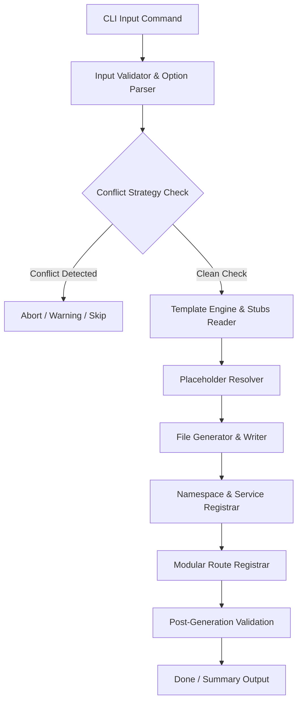
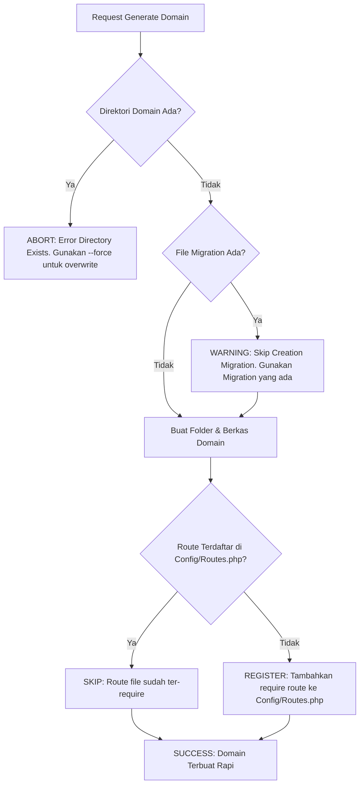

# MasjidCMS — Domain Generator Architecture Specification

**Versi:** 1.0 (Design Document — Persiapan Implementasi TASK-020)  
**Status:** APPROVED DESIGN SPECIFICATION  
**Fase:** Phase 4 — Code Generation Engine  
**Tanggal:** 27 Juli 2026  
**Penulis:** Senior Software Architect  

---

## Executive Summary

Dokumen ini mendokumentasikan spesifikasi arsitektur teknis **Domain Generator Engine** (`php spark make:domain`). Generator ini dirancang untuk mendongkrak produktivitas pengembang dalam membuat struktur *Business Domain* baru di **MasjidCMS** secara otomatis, 100% konsisten dengan standar **Golden Domain Template (docs/DOMAIN_TEMPLATE.md)**, serta bebas dari kesalahan manual (*human-error*).

---

## 1. Generator Architecture

Domain Generator bekerja sebagai pipeline transaksional multi-tahap. Setiap tahap memiliki peran terisolasi untuk memastikan file yang dihasilkan valid dan tidak merusak repositori yang ada.



### Tahapan Pipeline Execution:
1. **CLI Input Command**: Menerima argumen nama domain (`<DomainName>`) dan opsi CLI.
2. **Input Validator**: Memvalidasi format nama domain (misalnya `PascalCase`, hanya karakter alphabetic).
3. **Conflict Strategy Check**: Memeriksa keberadaan direktori `app/Domains/<DomainName>/` dan file target.
4. **Template Engine & Stubs Reader**: Membaca stub berkas cetak biru dari `docs/DOMAIN_TEMPLATE.md` / `app/Core/Generators/Stubs/`.
5. **Placeholder Resolver**: Menggantikan seluruh variabel placeholder (`{{Domain}}`, `{{Entity}}`, `{{Table}}`, dll.) dengan nilai kontekstual.
6. **File Generator & Writer**: Menuliskan file fisik ke struktur direktori domain target.
7. **Namespace & Service Registrar**: Menyelaraskan autoloader dan registrasi service.
8. **Modular Route Registrar**: Memasukkan pendaftaran file rute domain ke `app/Config/Routes.php` jika belum terdaftar.
9. **Post-Generation Validation**: Verifikasi kelengkapan berkas yang dibuat.

---

## 2. CLI Specification

### Syntax Command:
```bash
php spark make:domain <DomainName> [options]
```

### Argumen:
- `<DomainName>` *(Wajib)*: Nama business domain dalam format `PascalCase` (Contoh: `Jamaah`, `Kajian`, `Donasi`, `Inventaris`, `Keuangan`).

### Options / Flags:
- `--api` *(Default: True)*: Menghasilkan DTO, REST Controller, dan Modular Routes.
- `--views` *(Default: False)*: Menghasilkan partial views di `app/Domains/<DomainName>/Views/`.
- `--migration` *(Default: True)*: Menghasilkan file migration skema tabel di `app/Database/Migrations/`.
- `--seeder` *(Default: True)*: Menghasilkan file database seeder di `app/Database/Seeds/`.
- `--policy` *(Default: True)*: Menghasilkan file otorisasi `Policy`.
- `--force`: Memaksa penulisan ulang (*overwrite*) jika berkas tertentu sudah ada (digunakan dengan hati-hati).

### Contoh Penggunaan CLI:
```bash
# Membuat Domain Jamaah lengkap (Default)
php spark make:domain Jamaah

# Membuat Domain Kajian tanpa seeder
php spark make:domain Kajian --no-seeder

# Membuat Domain Keuangan dengan tambahan Views
php spark make:domain Keuangan --views
```

---

## 3. Generated Structure

Generator akan membuat struktur 17+ file dan folder secara presisi di bawah `app/Domains/<DomainName>/`:

```
app/Domains/{{Domain}}/
├── Config/
│   └── {{Domain}}Config.php
├── Controllers/
│   └── {{Domain}}Controller.php
├── DTO/
│   ├── Create{{Entity}}DTO.php
│   └── Update{{Entity}}DTO.php
├── Entities/
│   └── {{Entity}}.php
├── Models/
│   └── {{Entity}}Model.php
├── Policies/
│   └── {{Policy}}.php
├── Providers/
│   └── {{Domain}}Provider.php
├── Repositories/
│   └── {{Domain}}Repository.php
├── Routes/
│   └── {{RouteSlug}}.php
├── Services/
│   └── {{Domain}}Service.php
├── Views/
└── README.md

File Tambahan Tergenerasi:
├── app/Database/Migrations/{{Timestamp}}_Create{{Table}}Table.php
├── app/Database/Seeds/{{Entity}}Seeder.php
├── docs/adr/ADR-XXX-{{Domain}}-Domain.md
├── docs/UAT/{{Domain}}-UAT.md
└── tests/unit/Domains/{{Domain}}DomainTest.php
```

---

## 4. Template Source Mapping

Generator wajib mengacu 100% pada aturan arsitektur yang tertulis di `docs/DOMAIN_TEMPLATE.md`. Seluruh stub yang digunakan oleh generator diletakkan di bawah `app/Core/Generators/Stubs/` atau diekstrak langsung dari spesifikasi template:

| Generator Output | Reference Standard in `docs/DOMAIN_TEMPLATE.md` |
| :--- | :--- |
| **Entity** | Mengimplementasikan `toArray()`, `fromArray()`, status helper, userstamps |
| **Repository** | Meng-extend `BaseRepository` & implement `CrudRepositoryInterface` |
| **Service** | Meng-extend `CrudService` (Validation -> Tx -> Repo -> Commit -> Generic Event -> Audit) |
| **Controller** | Thin Controller (`Request` -> `DTO` -> `Service` -> `ResponseFormatter`) |
| **DTO** | Imutabel DTO dengan method `fromArray()` dan `toArray()` |
| **Routes** | Group route modular di `app/Domains/{{Domain}}/Routes/{{RouteSlug}}.php` |
| **Tests** | 7 Pengujian standar (CRUD, Validation, Tx, Rollback, Generic Events, Audit, Mock Repo) |

---

## 5. Placeholder Conventions

Seluruh stub file menggunakan sistem placeholder berikut untuk substitusi variabel:

| Placeholder Tag | Deskripsi Substitusi | Contoh Input `Jamaah` | Contoh Input `KajianSub` |
| :--- | :--- | :--- | :--- |
| `{{Domain}}` | Nama Domain (`PascalCase`) | `Jamaah` | `KajianSub` |
| `{{Entity}}` | Nama Entitas Utama (`PascalCase`) | `Jamaah` | `KajianSub` |
| `{{Table}}` | Nama Tabel DB (`snake_case` Plural) | `jamaahs` | `kajian_subs` |
| `{{RouteSlug}}` | Kategori URL Route (`kebab-case` Singular/Plural) | `jamaah` | `kajian-sub` |
| `{{Namespace}}` | Namespace Utama | `App\Domains\Jamaah` | `App\Domains\KajianSub` |
| `{{VariableSingular}}` | Variable Lokal Singular (`camelCase`) | `$jamaah` | `$kajianSub` |
| `{{VariablePlural}}` | Variable Lokal Plural (`camelCase`) | `$jamaahs` | `$kajianSubs` |
| `{{Timestamp}}` | Format Tanggal Migration | `2026-07-27-070000` | `2026-07-27-070000` |
| `{{Year}}` | Tahun rilis | `2026` | `2026` |

---

## 6. Conflict Resolution Strategy

Generator dilengkapi mekanisme proteksi (*safety mechanism*) untuk mencegah penimpaan berkas yang tidak disengaja.



### Aturan Penanganan Konflik:
1. **Existing Domain Folder**: Jika folder `app/Domains/<DomainName>/` sudah terbentuk, generator **wajib membatalkan proses (ABORT)** dengan exit code 1 untuk mencegah kerusakan kode yang sudah ada, kecuali flag `--force` diberikan.
2. **Existing Migration / Seeder**: Jika file migration atau seeder dengan nama identik sudah ditemukan di `app/Database/`, generator memberikan pesan `[WARNING]` dan melompati pembuatan file migration tersebut (`[SKIP]`).
3. **Duplicate Route Requirement**: Sebelum menambahkan `require APPPATH . 'Domains/<DomainName>/Routes/<route>.php';` ke `app/Config/Routes.php`, generator memeriksa apakah klausa `require` tersebut sudah ada. Jika sudah ada, penambahan dilompati (`[SKIP]`).

---

## 7. Extensibility Model

Arsitektur generator dirancang modular berorientasi *Command Pattern* sehingga dapat dikembangkan pada fase berikutnya untuk mendukung perintah turunan tanpa merubah fondasi engine:

```
App\Core\Generators\
├── BaseGeneratorCommand.php        # Core Engine Resolver & File Writer
├── DomainGeneratorCommand.php      # Command php spark make:domain
├── ModuleGeneratorCommand.php      # Future: php spark make:module
├── FeatureGeneratorCommand.php     # Future: php spark make:feature
└── AggregateGeneratorCommand.php   # Future: php spark make:aggregate
```

Sistem resolver stubs terpisah dari logika CLI parsing, sehingga penambahan komando generator baru di masa depan hanya memerlukan pendaftaran stub template baru tanpa menyentuh core platform.

---

## 8. Acceptance Criteria (Persyaratan Kesiapan Implementasi)

Generator yang diimplementasikan pada **TASK-020** dinyatakan **PASS** apabila memenuhi kriteria berikut:

- [x] **Zero Manual Editing**: Setelah menjalankan `php spark make:domain <Name>`, seluruh struktur domain siap dijalankan tanpa perlu mengedit namespace atau file import secara manual.
- [x] **Structure Parity**: File dan folder yang tergenerasi 100% identik dengan spesifikasi **Golden Domain Template (docs/DOMAIN_TEMPLATE.md)**.
- [x] **Namespace Validity**: Seluruh kelas tergenerasi memiliki namespace yang benar dan dapat di-autoload oleh PHP / CodeIgniter 4.
- [x] **No Duplicate Routes**: Registrasi route di `app/Config/Routes.php` bersifat *idempotent* (tidak terduplikasi meskipun command dijalankan berulang kali).
- [x] **Instant Test Passing**: Pengujian unit `tests/unit/Domains/<DomainName>DomainTest.php` yang dihasilkan oleh generator langsung dapat dijalankan via PHPUnit dengan status **PASS**.

---

## 9. Rekomendasi Kesiapan Implementasi TASK-020

> **REKOMENDASI SENIOR SOFTWARE ARCHITECT:**  
> **DESAIN ARSITEKTUR DOMAIN GENERATOR DIKLASIFIKASIKAN MATANG & LENGKAP.**  
> Dokumen spesifikasi ini telah mencakup seluruh workflow, skema substitusi placeholder, aturan proteksi konflik, serta pengujian yang dibutuhkan.  
> Platform MasjidCMS **SIAP 100% UNTUK MELANJUTKAN KE TASK-020 (Implementasi Domain Generator CLI Tool).**
