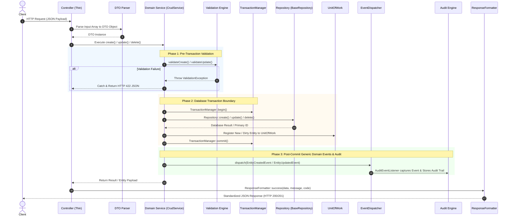

# MasjidCMS — Golden Domain Template Specification

**Versi:** 1.0 (Berdasarkan Implementasi Referensi Domain Masjid — TASK-017)  
**Status:** APPROVED ARCHITECTURE STANDARD — Wajib Diikuti Seluruh Business Domain  
**Tanggal:** 27 Juli 2026  
**Penulis:** Senior Software Architect  

---

## Executive Summary

Dokumen ini menetapkan **Golden Domain Template** sebagai acuan standar resmi pembuatan dan pengorganisasian seluruh **Business Domain** di **MasjidCMS** (seperti *Jamaah*, *Kajian*, *Donasi*, *Inventaris*, *Keuangan*, dll.).

Setiap Business Domain yang dibangun di atas MasjidCMS Platform **WAJIB** mengikuti struktur, pola arsitektur, siklus hidup request, aturan pengujian, dan konvensi pengkodean yang didefinisikan dalam dokumen ini tanpa terkecuali.

---

## 1. Folder Structure

Setiap Business Domain ditempatkan di dalam folder `app/Domains/{DomainName}/` dengan struktur direktori standar sebagai berikut:

```
app/Domains/ExampleDomain/
├── Config/
│   └── ExampleDomainConfig.php       # Konfigurasi khusus domain (jika ada)
├── Controllers/
│   └── ExampleController.php         # REST Controller (Thin Layer)
├── DTO/
│   ├── CreateExampleDTO.php          # DTO untuk pembuatan entitas
│   └── UpdateExampleDTO.php          # DTO untuk pembaruan entitas
├── Entities/
│   └── ExampleEntity.php             # Domain Entity (Rich Object / Value Object)
├── Models/
│   └── ExampleModel.php              # CI4 Model Adapter (Table Metadata Only)
├── Policies/
│   └── ExamplePolicy.php             # Authorization Policy Domain
├── Providers/
│   └── ExampleProvider.php           # Domain Service & Lifecycle Provider
├── Repositories/
│   └── ExampleRepository.php         # Data Access Layer (Extends BaseRepository)
├── Routes/
│   └── example.php                   # Modular REST Route Definition
├── Services/
│   └── ExampleService.php            # Business Service (Extends CrudService)
├── Database/                         # (Opsional jika domain memiliki skema khusus)
│   ├── Migrations/
│   └── Seeds/
├── Views/                            # Partial Views domain (jika ada UI server-side)
└── README.md                         # Dokumentasi Arsitektur & Alur Domain
```

> [!IMPORTANT]
> **Single Source of Truth Database**: Migration dan Seeder dapat diletakkan pada `app/Domains/{DomainName}/Database/` atau `app/Database/` selama **hanya ada satu lokasi tunggal** (tidak di-mirror/duplikasi).

---

## 2. Request Lifecycle

Setiap HTTP Request yang masuk ke Business Domain wajib melewati urutan eksekusi berlapis berikut:



---

## 3. Repository Pattern

### Aturan Utama:
1. **Pintu Akses Tunggal Data:** `Repository` adalah satu-satunya komponen yang diizinkan melakukan kueri ke basis data.
2. **Tanpa SQL di Outside Layer:** **DILARANG HARAM** menuliskan SQL query, Query Builder CodeIgniter (`$db->table()`), atau panggilan model langsung pada **Controller** maupun **Service**.
3. **Pewarisan Standard:** Seluruh Repository domain wajib meng-extend `App\Core\Repositories\BaseRepository` dan mengimplementasikan `App\Core\Contracts\CrudRepositoryInterface`.
4. **Adapter Model CI4:** Jika menggunakan fitur CodeIgniter 4 Model, buat kelas Model sebagai metadata adapter (nama tabel, `allowedFields`, `useSoftDeletes`) yang di-wrap oleh Repository.

### Contoh Implementasi:
```php
namespace App\Domains\ExampleDomain\Repositories;

use App\Core\Repositories\BaseRepository;

class ExampleRepository extends BaseRepository
{
    protected string $table = 'examples';

    public function findByCode(string $code): ?array
    {
        $row = $this->builder()->where('code', $code)->where('deleted_at', null)->get()->getRowArray();
        return $row ?: null;
    }
}
```

---

## 4. Service Pattern

### Aturan Utama:
1. **Pewarisan `CrudService`:** Seluruh Business Service wajib meng-extend `App\Core\CRUD\CrudService`.
2. **Jangan Menduplikasi Logika CRUD:** Logika standar Create, Read (Find/Paginate), Update, Delete, dan Restore sudah disediakan oleh `CrudService`. Service domain hanya perlu meng-override validation hooks (`validateCreate`, `validateUpdate`) dan lifecycle hooks (`beforeCreate`, `afterCreate`, dll.) jika ada kebutuhan khusus.
3. **Integrasi Komponen Core:** Service domain memobilisasi **Validation Engine**, **TransactionManager**, **UnitOfWork**, **EventDispatcher**, dan **Audit Engine** secara otomatis melalui `CrudService`.

### Contoh Implementasi:
```php
namespace App\Domains\ExampleDomain\Services;

use App\Core\CRUD\CrudService;
use App\Domains\ExampleDomain\Repositories\ExampleRepository;

class ExampleService extends CrudService
{
    protected string $entityName = 'Example';

    public function __construct(?ExampleRepository $repository = null)
    {
        parent::__construct(repository: $repository ?? new ExampleRepository());
    }

    protected function validateCreate(array $data): void
    {
        // Panggilan Validation Engine
    }
}
```

---

## 5. Controller Pattern

### Aturan Utama:
1. **Thin Controller:** Controller **DILARANG** memiliki *Business Logic*, logika transaksi database, maupun logika validasi manual.
2. **Tugas Controller Hanya 4 Langkah:**
   1. Menerima HTTP Request.
   2. Memetakan payload ke DTO (`CreateExampleDTO::fromArray()`).
   3. Memanggil Service Layer (`$this->service->create()`).
   4. Mengembalikan respons via `ResponseFormatter::success()` atau `ResponseFormatter::error()`.

### Contoh Implementasi:
```php
namespace App\Domains\ExampleDomain\Controllers;

use App\Core\Controllers\BaseController;
use App\Core\Exceptions\ValidationException;
use App\Domains\ExampleDomain\DTO\CreateExampleDTO;
use App\Domains\ExampleDomain\Services\ExampleService;
use CodeIgniter\HTTP\ResponseInterface;

class ExampleController extends BaseController
{
    protected ExampleService $service;

    public function __construct(?ExampleService $service = null)
    {
        $this->service = $service ?? new ExampleService();
    }

    public function create(): ResponseInterface
    {
        $payload = $this->request->getJSON(true) ?? $this->request->getPost();

        try {
            $dto = CreateExampleDTO::fromArray($payload ?? []);
            $result = $this->service->create($dto->toArray());

            return $this->respondSuccess($result, 'Created successfully', 201);
        } catch (ValidationException $e) {
            return $this->respondError($e->getMessage(), $e->getErrors(), 422);
        }
    }
}
```

---

## 6. Validation Pattern

### Aturan & Rekomendasi Arsitektur:
1. **Pre-Transaction Execution:** Validasi input **wajib** dilakukan padahook `validateCreate()` / `validateUpdate()` **sebelum** transaksi database dibuka.
2. **Pemisahan Logika Create vs Update:** Aturan validasi pembuatan data (Create) dan pembaruan data (Update) harus dipisahkan (karena operasi update sering kali bersifat parsial atau mengabaikan keunikan ID entitas itu sendiri).
3. **Standalone Domain Validator (Rekomendasi Skala Besar):** Untuk domain kompleks, sangat direkomendasikan membuat kelas Validator terpisah di folder `app/Domains/{Domain}/Validation/{ExampleValidator}.php` daripada menumpuk seluruh aturan di dalam method Service.

---

## 7. Event Pattern

### Aturan Utama:
1. **Gunakan Generic Domain Events:** Seluruh transaksi CRUD standar wajib menggunakan Generic Domain Event dari `App\Core\Events\`:
   - `EntityCreatedEvent`
   - `EntityUpdatedEvent`
   - `EntityDeletedEvent`
2. **Kapan Boleh Membuat Custom Event?** Event khusus domain (misalnya `DonasiReceivedEvent` atau `KajianPublishedEvent`) **hanya boleh dibuat** jika proses bisnis membutuhkan payload tambahan atau memicu workflow spesifik diluar penulisan log audit standar.

---

## 8. Media Storage Pattern

### Aturan Utama:
1. **Prinsip Indirect Reference:** Dilarang keras menyimpan URL atau path lokasi file (seperti `/uploads/logo.png`) secara mentah di kolom database domain.
2. **Alur Pengunggahan File:**
   ```
   Upload File Payload ──► StorageService ──► UploadPipeline ──► Record Media Entity ──► Return media_id
   ```
3. **Kolom Database:** Tabel domain hanya menyimpan kolom referensi kunci asing `media_id` (misalnya `logo_media_id`, `attachment_media_id`).

---

## 9. Testing Pattern

Setiap Business Domain **WAJIB** dilengkapi unit test & integration test di folder `tests/unit/Domains/{DomainName}Test.php` yang menguji minimal 7 aspek berikut:

| Aspek Pengujian | Deskripsi Validasi |
| :--- | :--- |
| **1. CRUD Lifecycle** | Memastikan siklus Create, Read, Update, Delete, dan Paginate berjalan normal. |
| **2. Validation Rules** | Memastikan aturan data wajib, format email/URL, dan keunikan melemparkan `ValidationException`. |
| **3. Transaction Boundary** | Memastikan operasi berjalan di dalam batasan `TransactionManager`. |
| **4. Rollback Behavior** | Memastikan jika terjadi exception di pertengahan proses, transaksi di-rollback bersih. |
| **5. Generic Event Dispatching** | Memastikan `EntityCreatedEvent`, `EntityUpdatedEvent`, dan `EntityDeletedEvent` tertembak. |
| **6. Audit Integration** | Memastikan `AuditEventListener` berhasil merekam aktivitas ke Audit Repository. |
| **7. Repository Double/Mock** | Memastikan pengujian domain dapat berjalan terisolasi menggunakan mock/fake repository. |

---

## 10. Documentation Pattern

Setiap Business Domain **WAJIB** memiliki 3 artefak dokumentasi lengkap:

1. **`app/Domains/{DomainName}/README.md`**: Menjelaskan arsitektur domain, tabel dependensi, alur CRUD, alur event, dan daftar endpoint API.
2. **`docs/adr/ADR-XXX-{DomainName}.md`**: Documenting Architecture Decision Record yang melatarbelakangi keputusan desain domain tersebut.
3. **`docs/UAT/TASK-XXX-UAT.md`**: Checklist pengujian User Acceptance Testing sebelum dirilis ke staging/production.

---

## 11. Coding Standards & Conventions

| Komponen | Konvensi Penamaan (Naming Convention) | Contoh Nama |
| :--- | :--- | :--- |
| **Namespace** | `App\Domains\{DomainName}\{Layer}` | `App\Domains\Donasi\Services` |
| **Controller** | `{EntityName}Controller.php` | `DonasiController.php` |
| **Service** | `{EntityName}Service.php` | `DonasiService.php` |
| **Repository** | `{EntityName}Repository.php` | `DonasiRepository.php` |
| **Entity** | `{EntityName}.php` | `Donasi.php` |
| **DTO Create** | `Create{EntityName}DTO.php` | `CreateDonasiDTO.php` |
| **DTO Update** | `Update{EntityName}DTO.php` | `UpdateDonasiDTO.php` |
| **Model Adapter** | `{EntityName}Model.php` | `DonasiModel.php` |
| **Policy** | `{EntityName}Policy.php` | `DonasiPolicy.php` |
| **Route File** | `app/Domains/{DomainName}/Routes/{domain_name}.php` | `app/Domains/Donasi/Routes/donasi.php` |

---

## 12. Domain Implementation Checklist

Setiap developer yang membangun Business Domain baru wajib menyelesaikan checklist berikut sebelum mengajukan Pull Request / Architecture Review:

- [ ] **Migration & Database Schema** (Skema tabel, primary key, unique constraints, Soft Delete `deleted_at`, timestamps, userstamps).
- [ ] **Database Seeder** (Menyediakan data awal / dummy sampel untuk pengujian).
- [ ] **Domain Entity** (Objek entity dengan properti lengkap, helper status, `toArray()`, `fromArray()`).
- [ ] **Create DTO & Update DTO** (Imutabel DTO dengan sanitasi data input).
- [ ] **Repository Layer** (Meng-extend `BaseRepository`, mengimplementasikan `CrudRepositoryInterface`).
- [ ] **CI4 Model Adapter** (Definisi metadata tabel, `$allowedFields`, dan soft deletes).
- [ ] **Service Layer** (Meng-extend `CrudService`, penanganan validation hooks & lifecycle hooks).
- [ ] **Policy Layer** (Aturan otorisasi hak akses entitas).
- [ ] **Controller Layer** (Thin controller, penanganan DTO & `ResponseFormatter`).
- [ ] **Modular Routes** (Pendaftaran REST endpoint di `app/Domains/{DomainName}/Routes/` dan di-load dari `Config/Routes.php`).
- [ ] **Domain README** (`app/Domains/{DomainName}/README.md`).
- [ ] **Architecture Decision Record** (`docs/adr/ADR-XXX-{DomainName}.md`).
- [ ] **UAT Checklist** (`docs/UAT/TASK-XXX-UAT.md`).
- [ ] **PHPUnit Test Suite** (Minimal 7 aspek pengujian PASS 100%).

---

## 13. Evaluasi & Rekomendasi Stabilitas (Persiapan TASK-019)

### Evaluasi Kesiapan:
Implementasi **Domain Masjid (TASK-017)** sebagai Pilot Domain dan pemurnian dokumen **Golden Domain Template (TASK-018)** ini telah membuktikan bahwa:
1. Struktur layer (`Controller -> DTO -> Service -> Repository -> Model`) sangat konsisten dan dapat diprediksi (*predictable*).
2. Pemanfaatan **Core Platform v1.0** (Generic CRUD Engine, Validation Engine, UnitOfWork, Generic Domain Event, Audit Engine, dan Storage Engine) berjalan 100% tanpa hambatan.
3. Seluruh kebutuhan domain bisnis baru dapat direpresentasikan menggunakan pola deklaratif yang seragam.

### Rekomendasi Software Architect:
**GOLDEN DOMAIN TEMPLATE SUDAH SANGAT STABIL.**  
Platform MasjidCMS **direkomendasikan dan dinyatakan SIAP** untuk melangkah ke **TASK-019 (Domain Generator CLI Tool)** untuk mengotomatisasi pembuatan *boilerplate* domain bisnis secara presisi dan bebas *human-error*.
