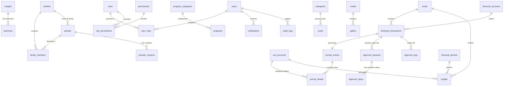

# MASJIDCMS ENTITY RELATIONSHIP DIAGRAM (ERD RC1)

```mermaid
erDiagram
    masjids ||--o{ branches : "has branches"
    families ||--o{ family_members : "contains"
    families ||--o{ jamaah : "head of family"
    jamaah ||--o{ family_members : "belongs to"
    jamaah ||--o{ jamaah_contacts : "has contacts"

    users ||--o{ user_roles : "assigned"
    roles ||--o{ user_roles : "granted to"
    roles ||--o{ role_permissions : "includes"
    permissions ||--o{ role_permissions : "granted"

    funds ||--o{ financial_transactions : "contains"
    financial_accounts ||--o{ financial_transactions : "linked"
    coa_accounts ||--o{ journal_details : "debited/credited"

    financial_transactions ||--|| journal_entries : "generates"
    journal_entries ||--o{ journal_details : "contains lines"
    financial_transactions ||--o{ approval_requests : "requires approval"
    financial_transactions ||--o{ approval_logs : "audit trail"
    approval_requests ||--o{ approval_steps : "has workflow steps"

    financial_periods ||--o{ budget : "defines"
    coa_accounts ||--o{ budget : "allocated"
    funds ||--o{ budget : "funded"

    program_categories ||--o{ programs : "categorizes"
    categories ||--o{ posts : "groups posts"
    media ||--o{ gallery : "displays"
    users ||--o{ notifications : "receives"
    users ||--o{ audit_logs : "triggers"
```
