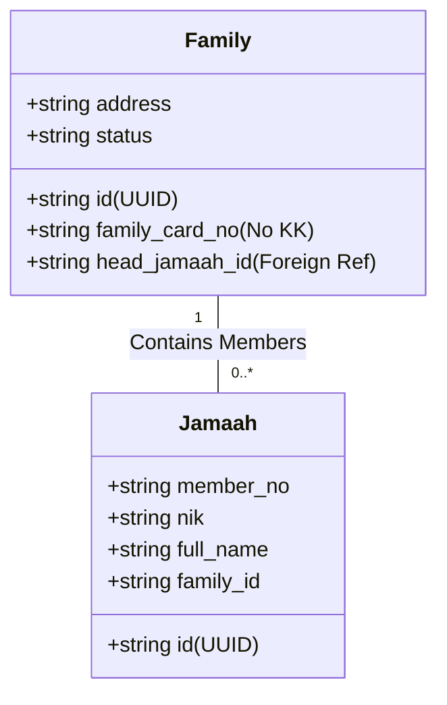
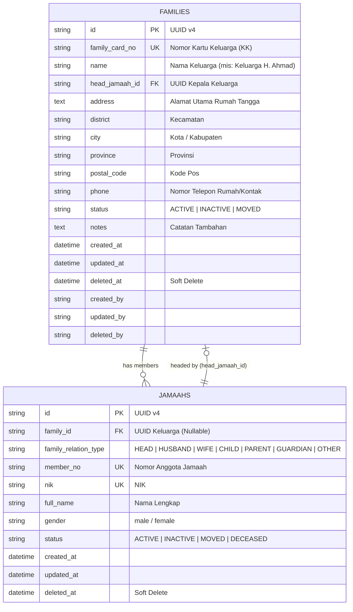
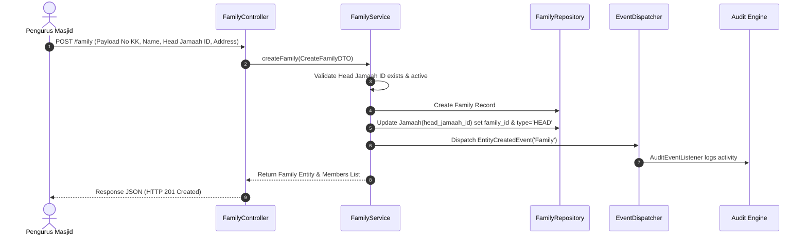
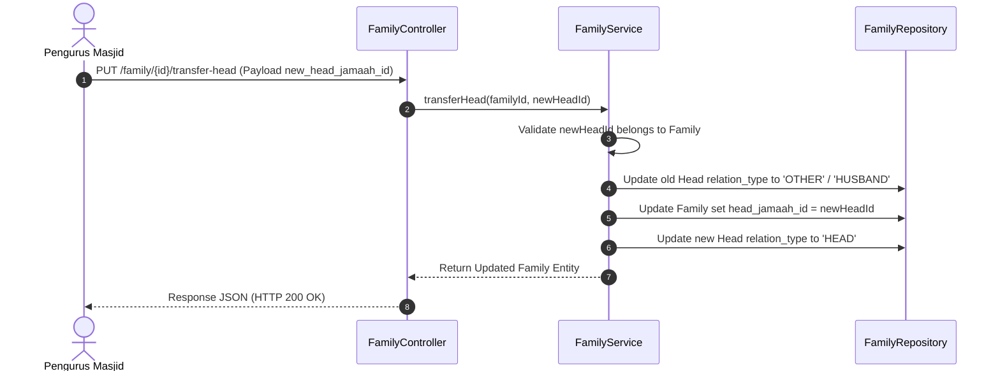

# MasjidCMS — Family Domain Business Analysis & Design Specification

**Versi:** 1.0 (Business Analysis & Architectural Design Document)  
**Status:** APPROVED ARCHITECTURE SPECIFICATION  
**Fase:** Product Development RC1  
**Tanggal:** 27 Juli 2026  
**Penulis:** Senior Software Architect & Business Analyst  

---

## Executive Summary

Dokumen ini mendokumentasikan analisis bisnis, trade-off arsitektur data, skema relasi entitas, diagram ER, alur bisnis, serta spesifikasi API untuk **Domain Keluarga (Family Domain)** di **MasjidCMS**. 

Domain Keluarga merupakan modul relasional penting yang mengelompokkan data Jamaah individual menjadi unit keluarga atau rumah tangga (Kartu Keluarga / KK). Pengelompokan ini menjadi basis bagi fitur operasional masjid di masa mendatang, seperti penyaluran Zakat Fitrah, distribusi hewan Qurban, program bantuan sosial (Mustahik/Bansos), serta undangan kegiatan pengajian berbasis rumah tangga.

---

## 1. Business Requirement

### 1.1 Masalah Bisnis Saat Ini
- **Data Terfragmentasi:** Pendataan jamaah pada Modul Jamaah RC1 saat ini berfokus pada data individu (`jamaahs`). Pengurus masjid kesulitan melihat hubungan antar-anggota keluarga yang tinggal di satu rumah tangga.
- **Kalkulasi Zakat & Qurban:** Program distribusi bantuan masjid dan perhitungan zakat fitrah umumnya diperhitungkan per rumah tangga / Kartu Keluarga, bukan per individu independen.
- **Efisiensi Komunikasi:** Mengirimkan informasi kegiatan masjid (seperti santunan atau undangan silaturahmi) per keluarga lebih efisien daripada mengirimkan pesan berulang ke setiap anggota individu.

### 1.2 Tujuan Utama Domain Keluarga
1. **Pemusatan Informasi Rumah Tangga:** Mengelompokkan jamaah ke dalam satu entitas Keluarga dengan nomor Kartu Keluarga (KK) dan alamat utama.
2. **Penetapan Kepala Keluarga:** Menyediakan mekanisme eksplisit untuk menentukan Kepala Keluarga yang bertanggung jawab atas entitas rumah tangga tersebut.
3. **Pemetaan Hubungan Kekeluargaan:** Mencatat peran kekeluargaan secara presisi (`suami`, `istri`, `anak`, `orang_tua`, `wali`, `lainnya`).
4. **Interoperabilitas dengan Core Platform:** Memanfaatkan secara penuh **Golden Domain Template (docs/DOMAIN_TEMPLATE.md)** tanpa merusak isolasi domain atau Core Platform.

---

## 2. Relationship Analysis (Jamaah <-> Family)

### 2.1 Pola Relasi Dasar
- **One Family -> Many Jamaah:** Satu Keluarga terdiri dari 1 hingga $N$ jamaah (misalnya Kepala Keluarga, Istri, Anak-anak, Orang Tua/Mertua).
- **Jamaah -> Family:** Setiap Jamaah idealnya terhubung ke 1 Keluarga (namun sistem harus mendukung Jamaah independen yang belum/tidak memiliki relasi keluarga).



---

## 3. Head of Family (Kepala Keluarga) Designation

Penetapan Kepala Keluarga dilakukan dengan pendekatan **Explicit Pointer Reference**:
- Pada tabel `families`, terdapat kolom `head_jamaah_id` (UUID) yang merujuk langsung ke `id` entitas `jamaahs`.
- **Aturan Bisnis Kepala Keluarga:**
  1. Kepala Keluarga **wajib** merupakan Jamaah yang terdaftar dan aktif.
  2. Kepala Keluarga secara otomatis bertindak sebagai penanggung jawab utama dalam laporan penerimaan Zakat/Qurban.
  3. Apabila status Kepala Keluarga berubah menjadi `DECEASED` (meninggal dunia) atau `MOVED` (pindah), sistem menyediakan alur **Transfer Head of Family** untuk memindahkan peran Kepala Keluarga ke anggota keluarga lain (misalnya Istri atau Anak Sulung).

---

## 4. Relationship Types Taxonomy

Setiap Jamaah di dalam Keluarga memiliki atribut tipe hubungan keluarga (`family_relation_type` / `relation_role`). Taksonomi yang didukung adalah:

| Kode Relasi | Nama Relasi | Deskripsi & Aturan Bisnis |
| :--- | :--- | :--- |
| `HEAD` | **Kepala Keluarga** | Jamaah utama penanggung jawab entitas keluarga (`head_jamaah_id`). |
| `HUSBAND` | **Suami** | Suami di dalam keluarga (jika Kepala Keluarga adalah Istri/Orang Tua). |
| `WIFE` | **Istri** | Pasangan sah dari Kepala Keluarga. |
| `CHILD` | **Anak** | Anak kandung, anak angkat, atau anak tiri. |
| `PARENT` | **Orang Tua** | Ayah, Ibu, atau Mertua dari Kepala Keluarga. |
| `GUARDIAN` | **Wali** | Wali sah bagi jamaah yang belum dewasa atau piatu. |
| `OTHER` | **Lainnya** | Kerabat lain (Sanak saudara, keponakan, ART) yang tinggal bersama. |

---

## 5. Database Design Trade-Off Analysis

Dua pendekatan arsitektur basis data dievaluasi untuk implementasi Domain Keluarga:

### Opsi A: Normalized Junction Table (`families` + `family_members`)
Membuat tabel `families` dan tabel perantara `family_members` (Direct Many-to-Many Architecture).

- **Skema:**
  - `families`: `id`, `family_card_no`, `head_jamaah_id`, `address`, `city`, `status`
  - `family_members`: `id`, `family_id`, `jamaah_id`, `relation_role`, `created_at`
- **Keunggulan:**
  - Sangat fleksibel; 1 Jamaah secara teoretis dapat terhubung ke lebih dari 1 keluarga dalam situasi khusus.
  - Pemisahan data murni (*pure normalization*).
- **Kelemahan:**
  - Membutuhkan `JOIN` 3 tabel untuk membaca data jamaah beserta keluarganya, meningkatkan kompleksitas kueri dan latency.
  - Memerlukan logika sinkronisasi ganda pada pencarian/paginasi.

### Opsi B: Foreign Reference on Jamaah + Direct Pointer on Family (`families` + `jamaahs.family_id`)
Membuat tabel `families` dan menambahkan kolom `family_id` serta `family_relation_type` pada tabel `jamaahs` (Direct 1-to-Many Architecture).

- **Skema:**
  - `families`: `id`, `family_card_no`, `head_jamaah_id`, `name`, `address`, `city`, `status`
  - `jamaahs`: `id`, `member_no`, ..., `family_id` (FK), `family_relation_type`
- **Keunggulan:**
  - Kueri sangat cepat dan sederhana. Pembacaan jamaah beserta keluarganya hanya membutuhkan 1 `JOIN` sederhana.
  - Mendukung paginasi, pencarian, dan penyaringan multi-kolom yang sudah ada pada `JamaahRepository` tanpa perombakan arsitektur.
  - Mengurangi beban transaksi database.
- **Kelemahan:**
  - 1 Jamaah hanya dapat menjadi anggota dari 1 Keluarga pada satu waktu (sesuai standar KK di Indonesia).

### 💡 Keputusan Rekomendasi Arsitektur: **OPSI B**
Opsi B dipilih karena **sesuai dengan realitas administrasi Kartu Keluarga (KK) di Indonesia** (di mana 1 NIK/Jamaah hanya terdaftar pada 1 KK aktif), serta memberikan kinerja kueri yang jauh lebih optimal dan selaras dengan **Golden Domain Template**.

---

## 6. Entity Relationship Diagram (ERD)



---

## 7. Business Flow & Lifecycle

### 7.1 Alur Pembuatan Keluarga Baru & Penambahan Anggota



### 7.2 Alur Pemindahan Kepala Keluarga (Head Transfer)



---

## 8. API Design Specification

Seluruh REST API untuk Domain Keluarga mengikuti konvensi **Golden Domain Template**:

| Method | Endpoint | Description | Query / Payload |
| :--- | :--- | :--- | :--- |
| `GET` | `/family` | Menampilkan daftar keluarga (Paginasi, Search, Filter, Sort) | `search`, `status`, `city`, `district`, `sort_by`, `page`, `per_page` |
| `GET` | `/family/{id}` | Menampilkan detail keluarga beserta seluruh anggota jamaahnya | - |
| `POST` | `/family` | Membuat KK / Keluarga baru & menetapkan Kepala Keluarga | `family_card_no`, `name`, `head_jamaah_id`, `address`, dll. |
| `PUT` | `/family/{id}` | Memperbarui data alamat/informasi keluarga | `name`, `address`, `phone`, `status`, dll. |
| `POST` | `/family/{id}/members` | Menambahkan anggota jamaah ke dalam keluarga | `jamaah_id`, `family_relation_type` |
| `DELETE` | `/family/{id}/members/{jamaah_id}` | Mengeluarkan jamaah dari keluarga (Detach) | - |
| `PUT` | `/family/{id}/transfer-head` | Memindahkan peran Kepala Keluarga ke anggota lain | `new_head_jamaah_id` |
| `DELETE` | `/family/{id}` | Menghapus data keluarga (Soft Delete) | - |

---

## 9. Migration & Integration Strategy

1. **Skema Database Non-Destruktif:**
   - Pembuatan tabel `families` melalui migration `2026-07-27-000000_CreateFamiliesTable.php`.
   - Penambahan kolom `family_id` (nullable) dan `family_relation_type` (nullable) pada tabel `jamaahs` melalui migration alter `2026-07-27-000001_AddFamilyFieldsToJamaahsTable.php`.
2. **Kompabilitas Data Jamaah RC1:**
   - Data jamaah yang sudah terdaftar pada TASK-021 tetap utuh dan valid (`family_id` bernilai `NULL` untuk jamaah mandiri).
   - Pengurus masjid dapat menghubungkan jamaah ke keluarga secara bertahap tanpa perlu melakukan *data wipe*.

---

## 10. Architectural Recommendation & Go / No Go Decision

```text
====================================================================
               FAMILY DOMAIN ANALYSIS REVIEW BOARD                  
====================================================================

Architecture Review Status : APPROVED
Design Integrity           : 100% Conforming to Golden Domain Template
Core Impact                : Zero Core Platform Modification
Go / No Go Decision        : GO TO IMPLEMENTATION (TASK-023)

====================================================================
```

### Pernyataan Rekomendasi:
Analisis bisnis dan desain arsitektur **Domain Keluarga (Family Domain)** dinyatakan **MATANG, AMAN, DAN DIREKOMENDASIKAN (GO)** untuk diimplementasikan pada tugas berikutnya tanpa ada hambatan arsitektur.
