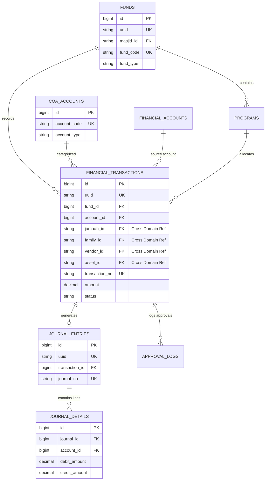

# MasjidCMS — Financial Data Model & Database Specification

**Versi:** 1.0 (Database Schema & Entity Specification)  
**Status:** PROPOSED DATA MODEL SPECIFICATION  
**Fase:** Product Development RC1  
**Tanggal:** 27 Juli 2026  
**Penulis:** Lead Database Architect & Financial Systems Analyst  

---

## Executive Summary

Dokumen ini mendokumentasikan spesifikasi **Data Model dan Desain Basis Data Final** untuk **Domain Keuangan (Financial Domain)** pada **MasjidCMS Product RC1**.

Spesifikasi ini dirancang berlandaskan **SAD v1.1** dan **ADR-0005 (Fund Accounting Model)**. Tujuan dokumen ini adalah mengunci (*lock*) seluruh skema tabel, strategi indeks, batasan integritas data (*constraints*), serta kesiapan skalabilitas sebelum tahap pengodean (*coding & migration*) dimulai.

---

## 1. Data Model Overview

Domain Keuangan MasjidCMS terdiri dari 9 entitas utama:

1. **`Fund` (Kantong Dana):** Entitas utama pembukuan terpisah (*General, Building, Zakat, Qurban, TPQ, Social*).
2. **`COA Account` (Chart of Accounts):** Klasifikasi akun standar akuntansi (Aset, Kewajiban, Saldo Dana, Penerimaan, Pengeluaran).
3. **`Financial Account` (Kas / Rekening Bank):** Akun fisik penyimpanan uang (Kas Tunai Utama, Bank Syariah, QRIS).
4. **`Program` (Program Kerja / Event):** Sub-pengelompokan kegiatan berbasis program (misal: *Pembangunan Menara, Ramadhan 1447H*).
5. **`Financial Transaction`:** Catatan transaksi penerimaan, pengeluaran, transfer, dan koreksi.
6. **`Journal Entry`:** Kepala jurnal ganda (*Double-Entry Header*) yang dihasilkan dari transaksi ter-posting.
7. **`Journal Detail`:** Baris rincian debit dan kredit (*Journal Lines*).
8. **`Approval Log`:** Log jejak persetujuan transaksi pengeluaran melebihi ambang batas.
9. **`Budget` (Kesiapan Masa Depan):** Anggaran perencanaan penerimaan & pengeluaran per program/fund.

---

## 2. Entity Ownership & Domain Boundaries

### 2.1 Domain Finance Owned Entities
Domain Finance memiliki (*owns*) dan mengelola penuh siklus hidup entitas berikut:
- `Fund`, `COA Account`, `Financial Account`, `Program`, `Financial Transaction`, `Journal Entry`, `Journal Detail`, `Approval Log`.

### 2.2 Cross-Domain References
Seluruh relasi ke luar domain finansial bersifat **Cross-Domain Reference** (Finance hanya menyimpan nilai ID referensi tanpa memiliki entitas tersebut):

| Foreign Reference Field | Target Domain | Status Kepemilikan (Ownership) |
| :--- | :--- | :--- |
| `masjid_id` | **Masjid Domain** | Milik Domain Masjid (Schema Ready, Single Masjid Runtime) |
| `jamaah_id` | **Jamaah Domain** | Milik Domain Jamaah (Donatur / Pembayar Zakat) |
| `family_id` | **Family Domain** | Milik Domain Family (Kartu Keluarga) |
| `vendor_id` | **Vendor (System) Domain** | Milik Domain Vendor (Pemasok / Toko Bangunan) |
| `asset_id` | **Asset Domain** | Milik Domain Asset (Pembelian Aset Fisik) |

---

## 3. Program Layer Architecture

Hierarki struktur pengelompokan transaksi:

```
[ FUND ] ──► [ PROGRAM (Optional) ] ──► [ TRANSACTION ]
```

### Justifikasi Arsitektural:
- **Pengelompokan Fleksibel:** Transaksi rutin (seperti Infaq Jumat atau Bayar Listrik) terhubung langsung ke `Fund` tanpa memerlukan `Program`.
- **Pelaporan Per-Kegiatan:** Transaksi khusus (seperti Infaq Buka Puasa Ramadhan) mengaitkan `program_id` sehingga laporan pertanggungjawaban program (*Special Program Report*) dapat dihasilkan secara seketika (*realtime*) tanpa merusak struktur kantong dana utama (`Fund`).

---

## 4. COA Architecture Strategy

### 4.1 Trade-off Analysis
1. **Opsi 1: Per-Fund COA (Akun Terikat Langsung ke Fund):**
   - *Kelemahan:* Redundansi kode akun (misal akun "Kas Tunai" harus dibuat berulang di setiap Fund).
2. **Opsi 2 (Recommended - ERP Standard): Global COA + Fund Mapping Table:**
   - *Keunggulan:* Kode akun COA bersifat terpusat (*Global Master COA*). Setiap transaksi mengaitkan `fund_id` dan `account_id` secara konsisten.
   - *Rekomendasi:* Mengadopsi **Global COA + Fund Mapping** demi skalabilitas dan keselarasan dengan standar ERP nirlaba.

---

## 5. Primary Key & Indexing Strategy (ADR-0005 Compliance)

Sesuai **ADR-0005** dan **SAD v1.1**:
- **Primary Key Fisik Internal:** `id BIGINT AUTO_INCREMENT PRIMARY KEY`  
  *Alasan:* Menjamin penyisipan data berurutan (*sequential B-Tree append*) untuk mencegah *page split* pada tabel transaksi ber-volume tinggi.
- **Identifier Publik Eksternal:** `uuid CHAR(36) NOT NULL UNIQUE`  
  *Alasan:* Mencegah enumerasi sequential ID pada URL REST API publik.

---

## 6. Database Tables & Field Specifications

### 6.1 Tabel `funds`
Mencatat kantong dana masjid.

| Field | Type | Nullable | Default | Index | Unique | FK / Description |
| :--- | :--- | :---: | :---: | :---: | :---: | :--- |
| `id` | `BIGINT` | No | AUTO_INC | PK | Yes | Primary Key Internal |
| `uuid` | `CHAR(36)` | No | None | Yes | Yes | Public UUID |
| `masjid_id` | `VARCHAR(36)` | No | None | Yes | No | Tenant Scope (Schema Ready) |
| `fund_code` | `VARCHAR(50)` | No | None | Yes | Yes | `GENERAL`, `BUILDING`, `ZAKAT`, `QURBAN`, `TPQ` |
| `name` | `VARCHAR(100)` | No | None | No | No | Nama Kantong Dana |
| `fund_type` | `VARCHAR(20)` | No | `'UNRESTRICTED'` | Yes | No | `UNRESTRICTED`, `RESTRICTED`, `ENDOWMENT` |
| `status` | `VARCHAR(20)` | No | `'ACTIVE'` | Yes | No | `ACTIVE`, `INACTIVE` |
| `created_at` | `DATETIME` | Yes | NULL | No | No | Timestamp Buat |
| `updated_at` | `DATETIME` | Yes | NULL | No | No | Timestamp Update |
| `deleted_at` | `DATETIME` | Yes | NULL | Yes | No | Soft Delete |

---

### 6.2 Tabel `coa_accounts`
Master akun Chart of Accounts.

| Field | Type | Nullable | Default | Index | Unique | FK / Description |
| :--- | :--- | :---: | :---: | :---: | :---: | :--- |
| `id` | `BIGINT` | No | AUTO_INC | PK | Yes | Primary Key Internal |
| `uuid` | `CHAR(36)` | No | None | Yes | Yes | Public UUID |
| `masjid_id` | `VARCHAR(36)` | No | None | Yes | No | Tenant Scope |
| `account_code`| `VARCHAR(20)` | No | None | Yes | Yes | Kode Akun (e.g. `10100`, `40100`, `50100`) |
| `name` | `VARCHAR(100)` | No | None | No | No | Nama Akun COA |
| `account_type`| `VARCHAR(20)` | No | None | Yes | No | `ASSET`, `LIABILITY`, `FUND_BALANCE`, `INCOME`, `EXPENSE` |
| `is_active` | `TINYINT(1)` | No | `1` | Yes | No | Status Aktif |

---

### 6.3 Tabel `financial_accounts`
Mencatat akun penyimpanan uang fisik (Kas/Bank/QRIS).

| Field | Type | Nullable | Default | Index | Unique | FK / Description |
| :--- | :--- | :---: | :---: | :---: | :---: | :--- |
| `id` | `BIGINT` | No | AUTO_INC | PK | Yes | Primary Key Internal |
| `uuid` | `CHAR(36)` | No | None | Yes | Yes | Public UUID |
| `masjid_id` | `VARCHAR(36)` | No | None | Yes | No | Tenant Scope |
| `code` | `VARCHAR(50)` | No | None | Yes | Yes | `KAS_UTAMA`, `BANK_BSI`, `QRIS_MASJID` |
| `name` | `VARCHAR(100)` | No | None | No | No | Nama Akun Kas/Bank |
| `account_number`| `VARCHAR(50)`| Yes | NULL | No | No | Nomor Rekening |
| `bank_name` | `VARCHAR(50)` | Yes | NULL | No | No | Nama Bank |
| `balance` | `DECIMAL(15,2)`| No | `0.00` | No | No | Saldo Berjalan (Rp) |

---

### 6.4 Tabel `programs`
Sub-kegiatan atau program khusus.

| Field | Type | Nullable | Default | Index | Unique | FK / Description |
| :--- | :--- | :---: | :---: | :---: | :---: | :--- |
| `id` | `BIGINT` | No | AUTO_INC | PK | Yes | Primary Key Internal |
| `uuid` | `CHAR(36)` | No | None | Yes | Yes | Public UUID |
| `masjid_id` | `VARCHAR(36)` | No | None | Yes | No | Tenant Scope |
| `fund_id` | `BIGINT` | No | None | Yes | No | FK to `funds.id` |
| `program_code`| `VARCHAR(50)`| No | None | Yes | Yes | `RAMADHAN-1447`, `RENOVASI-TOWER` |
| `name` | `VARCHAR(150)`| No | None | No | No | Nama Program |
| `target_amount`| `DECIMAL(15,2)`| Yes| NULL | No | No | Target Anggaran |
| `status` | `VARCHAR(20)` | No | `'ACTIVE'` | Yes | No | `ACTIVE`, `COMPLETED` |

---

### 6.5 Tabel `financial_transactions`
Mencatat seluruh transaksi keuangan.

| Field | Type | Nullable | Default | Index | Unique | FK / Description |
| :--- | :--- | :---: | :---: | :---: | :---: | :--- |
| `id` | `BIGINT` | No | AUTO_INC | PK | Yes | Primary Key Internal |
| `uuid` | `CHAR(36)` | No | None | Yes | Yes | Public UUID |
| `masjid_id` | `VARCHAR(36)` | No | None | Yes | No | Tenant Scope |
| `fund_id` | `BIGINT` | No | None | Yes | No | FK to `funds.id` |
| `account_id` | `BIGINT` | No | None | Yes | No | FK to `coa_accounts.id` |
| `financial_account_id`| `BIGINT`| No | None | Yes | No | FK to `financial_accounts.id` |
| `program_id` | `BIGINT` | Yes | NULL | Yes | No | FK to `programs.id` |
| `jamaah_id` | `VARCHAR(36)` | Yes | NULL | Yes | No | Cross Domain Ref (Jamaah) |
| `family_id` | `VARCHAR(36)` | Yes | NULL | Yes | No | Cross Domain Ref (Family) |
| `vendor_id` | `VARCHAR(36)` | Yes | NULL | Yes | No | Cross Domain Ref (Vendor) |
| `asset_id` | `VARCHAR(36)` | Yes | NULL | Yes | No | Cross Domain Ref (Asset) |
| `transaction_no`| `VARCHAR(50)`| No | None | Yes | Yes | e.g. `TRX-20260727-001` |
| `transaction_type`| `VARCHAR(20)`| No | None | Yes | No | `INCOME`, `EXPENSE`, `TRANSFER`, `ADJUSTMENT` |
| `amount` | `DECIMAL(15,2)`| No | None | Yes | No | Nominal Transaksi (Rp) |
| `payment_method`| `VARCHAR(20)`| No | `'CASH'` | No | No | `CASH`, `BANK_TRANSFER`, `QRIS` |
| `status` | `VARCHAR(20)` | No | `'POSTED'` | Yes | No | `DRAFT`, `PENDING_APPROVAL`, `POSTED`, `REJECTED` |
| `transaction_date`| `DATETIME`| No | None | Yes | No | Tanggal Transaksi |
| `description` | `TEXT` | Yes | NULL | No | No | Catatan / Uraian |
| `created_by` | `VARCHAR(36)` | Yes | NULL | No | No | Userstamp Buat |
| `approved_by` | `VARCHAR(36)` | Yes | NULL | No | No | Userstamp Approver |
| `posted_at` | `DATETIME` | Yes | NULL | No | No | Timestamp Jurnal Post |

---

### 6.6 Tabel `journal_entries`
Header jurnal ganda (*Double-Entry Header*).

| Field | Type | Nullable | Default | Index | Unique | FK / Description |
| :--- | :--- | :---: | :---: | :---: | :---: | :--- |
| `id` | `BIGINT` | No | AUTO_INC | PK | Yes | Primary Key Internal |
| `uuid` | `CHAR(36)` | No | None | Yes | Yes | Public UUID |
| `transaction_id`| `BIGINT` | No | None | Yes | Yes | FK to `financial_transactions.id` |
| `journal_no` | `VARCHAR(50)` | No | None | Yes | Yes | e.g. `JRN-20260727-001` |
| `entry_date` | `DATETIME` | No | None | Yes | No | Tanggal Jurnal |
| `description` | `TEXT` | Yes | NULL | No | No | Keterangan Jurnal |

---

### 6.7 Tabel `journal_details`
Rincian debit & kredit (*Journal Lines*).

| Field | Type | Nullable | Default | Index | Unique | FK / Description |
| :--- | :--- | :---: | :---: | :---: | :---: | :--- |
| `id` | `BIGINT` | No | AUTO_INC | PK | Yes | Primary Key Internal |
| `journal_id` | `BIGINT` | No | None | Yes | No | FK to `journal_entries.id` |
| `account_id` | `BIGINT` | No | None | Yes | No | FK to `coa_accounts.id` |
| `debit_amount` | `DECIMAL(15,2)`| No | `0.00` | No | No | Nominal Debit |
| `credit_amount`| `DECIMAL(15,2)`| No | `0.00` | No | No | Nominal Kredit |

---

### 6.8 Tabel `approval_logs`
LogJejak Persetujuan.

| Field | Type | Nullable | Default | Index | Unique | FK / Description |
| :--- | :--- | :---: | :---: | :---: | :---: | :--- |
| `id` | `BIGINT` | No | AUTO_INC | PK | Yes | Primary Key Internal |
| `transaction_id`| `BIGINT` | No | None | Yes | No | FK to `financial_transactions.id` |
| `approver_user_id`| `VARCHAR(36)`| No | None | Yes | No | User ID Approver |
| `action` | `VARCHAR(20)` | No | None | Yes | No | `APPROVED`, `REJECTED` |
| `notes` | `TEXT` | Yes | NULL | No | No | Catatan Persetujuan |
| `created_at` | `DATETIME` | No | None | No | No | Timestamp Eksekusi |

---

## 7. Relationship Diagram (Mermaid ERD)



---

## 8. Indexing Strategy Matrix

| Table Name | Index Name | Index Type | Indexed Columns | Business Purpose |
| :--- | :--- | :--- | :--- | :--- |
| `financial_transactions` | `idx_trx_date_fund` | Composite | `(transaction_date, fund_id)` | Akses laporan harian/bulanan per Fund |
| `financial_transactions` | `idx_trx_status` | Single | `(status)` | Filter transaksi pending approval |
| `financial_transactions` | `idx_trx_cross_ref` | Composite | `(jamaah_id, family_id)` | Pencarian kuitansi donasi jamaah |
| `journal_entries` | `idx_jrn_date` | Single | `(entry_date)` | Pencarian jurnal per periode |
| `journal_details` | `idx_jrn_line_acc` | Composite | `(journal_id, account_id)` | Kueri saldo Buku Besar (*General Ledger*) |

---

## 9. Constraint Strategy Matrix

| Constraint Name | Type | Target Column | Policy / Behavior | Business Rationale |
| :--- | :--- | :--- | :--- | :--- |
| `uk_fund_code` | `UNIQUE` | `funds.fund_code` | `REJECT` | Mencegah duplikasi kode kantong dana |
| `uk_account_code`| `UNIQUE` | `coa_accounts.account_code` | `REJECT` | Mencegah duplikasi kode akun COA |
| `fk_trx_fund` | `FOREIGN KEY` | `financial_transactions.fund_id` | `RESTRICT` | Mencegah penghapusan Fund yang memiliki transaksi |
| `fk_jrn_line` | `FOREIGN KEY` | `journal_details.journal_id` | `CASCADE` | Menghapus baris rincian jika header jurnal dihapus |

---

## 10. Audit Strategy

Seluruh entitas utama memuat standar kolom jejak audit (*Audit Userstamps & Timestamps*):
- `created_at`, `updated_at`, `deleted_at` (Soft Delete)
- `created_by`, `updated_by` (User ID eksekutor)
- `approved_by` (User ID pejabat persetujuan DKM)
- `posted_at` (Timestamp pembentukan jurnal ganda)

---

## 11. Scalability Analysis Matrix

| Scale Tier | Projected Records | Bottleneck Risk | Mitigation Strategy |
| :--- | :--- | :--- | :--- |
| **Tier 1 (Small Mosque)** | 100 - 10.000 trx/year | Low | Standard MySQL / SQLite storage |
| **Tier 2 (Medium Mosque)**| 10k - 100k trx/year | Low-Medium | Indexed `(transaction_date, fund_id)` query optimization |
| **Tier 3 (Large/Grand Mosque)**| 1M trx/year | Index Fragmentation | `BIGINT AUTO_INCREMENT` PK avoids page-split overhead |
| **Tier 4 (Multi-Masjid SaaS)**| 10M+ trx/year | Tenant Lock / Slow Ledger | Partitioning by `masjid_id` & Year |

---

## 12. Future Extension Readiness

Skema basis data dirancang siap mengakomodasi modul masa depan tanpa perubahan struktur inti (*Zero Core Breaking Change*):

1. **Payroll / Penggajian:** Siap mengaitkan `account_id` pengeluaran gaji & cross ref `jamaah_id` pegawai.
2. **Asset Depreciation:** Siap mencatat jurnal akumulasi penyusutan Aset via `journal_entries`.
3. **QRIS & Payment Gateway:** Kolom `payment_method` dan `transaction_no` mendukung webhook ID gateway.
4. **Bank Reconciliation:** Tabel `financial_accounts` mendukung pencocokan mutasi bank.

---

## 13. Implementation Readiness Checklist

| Feature Component | Readiness Status | Architectural Action Needed |
| :--- | :---: | :--- |
| **Fund & COA Schema** | **READY** | Siap untuk Migration `RC1` |
| **Transaction & Journal Schema** | **READY** | Siap untuk Migration `RC1` |
| **Option A PK Strategy** | **READY** | Compliant with `ADR-0005` |
| **Cross-Domain Foreign References**| **READY** | Stored as Foreign Ref IDs |
| **Reusable Approval Engine** | **NEED ADR** | Memerlukan ADR terpisah sebelum dipisahkan dari Finance |
| **Automated Event-Driven Audit** | **NEED ADR** | Memerlukan ADR terpisah untuk async event engine |
| **Payroll & Asset Depreciation** | **FUTURE** | Skema siap, modul out-of-scope RC1 |
