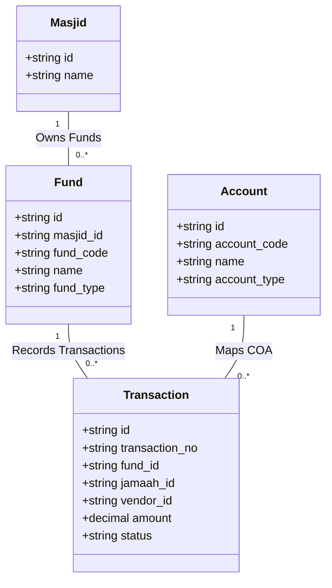
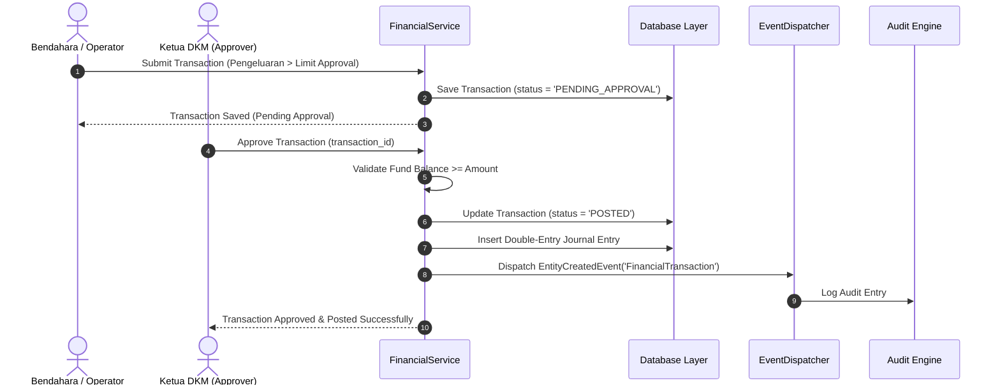
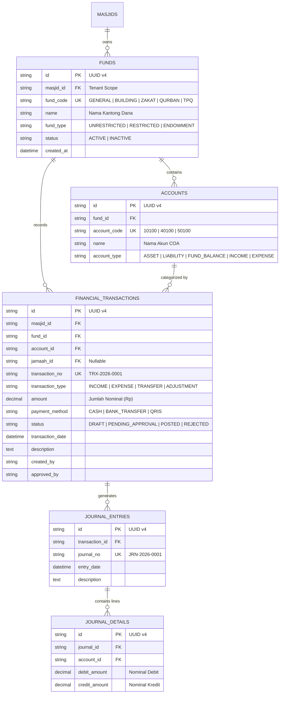

# MasjidCMS — Financial Domain Business Analysis & Architecture Specification

**Versi:** 1.0 (Financial Domain Architectural Analysis & Specification)  
**Status:** APPROVED ARCHITECTURE SPECIFICATION  
**Fase:** Product Development RC1  
**Tanggal:** 27 Juli 2026  
**Penulis:** Lead Software Architect & Financial Systems Analyst  

---

## Executive Summary

Dokumen ini mendokumentasikan analisis bisnis, aturan syariah/akuntansi, struktur basis data, serta spesifikasi arsitektur untuk **Domain Keuangan (Financial Domain)** pada **MasjidCMS Product RC1**.

Domain Keuangan MasjidCMS mengadopsi prinsip **Fund Accounting (Akuntansi Nirlaba Nirlaba/Entitas Nirlaba Keagamaan)** yang memisahkan pembukuan dana secara ketat sesuai peruntukan (*restricted funds* vs *unrestricted funds*). Pendekatan ini memastikan akuntabilitas, transparansi publik, serta pencegahan pelanggaran syariat (seperti penggunaan dana Zakat untuk operasional fisik masjid).

---

## 1. Business Requirement (Analisis Kebutuhan Lapangan)

Pengelolaan keuangan masjid di Indonesia memiliki karakteristik unik yang memerlukan pemisahan kantong dana (*Fund Separation*):

1. **Kas Operasional (General / Operational Fund):**
   Penerimaan infaq kotakan Jumat, infaq harian, dan donasi umum. Digunakan untuk biaya listrik, air, honor Marbot/Imam/Muadzin, kebersihan, dan pemeliharaan ringan.
2. **Dana Pembangunan (Building / Capital Fund):**
   Infaq khusus pembangunan, renovasi gedung, menara, atau pembebasan tanah.
3. **Dana ZISWAF (Zakat, Infaq, Shadaqah Terikat, Wakaf):**
   Penerimaan Zakat Fitrah, Zakat Mal, Fidyah, Infaq Terikat (Mustahik/Bansos), dan Wakaf Uang/Tanah.
4. **Dana Pengelolaan Qurban (Qurban Fund):**
   Penerimaan pendaftaran mudi, pembelian hewan, biaya operasional jagal, dan kupon distribusi.
5. **Dana Pendidikan / TPQ (Education Fund):**
   SPP santri TPQ, insentif Guru TPQ, dan pembelian alat tulis/buku modul.
6. **Dana Pelayanan Umat / Ambulans & Sosial (Social Services Fund):**
   Infaq operasional ambulans gratis, santunan anak yatim, dan bantuan pengurusan jenazah.
7. **Dana Kegiatan Ramadhan & PHBI (Special Program Fund):**
   Infaq Buka Puasa Bersama (Iftar), I'tikaf, Tarawih, serta Peringatan Hari Besar Islam.

---

## 2. Fund Accounting Strategy vs Commercial Accounting

### 2.1 Evaluasi Model Akuntansi
- **Model Akuntansi Komersial (Perusahaan):** Berfokus pada profitabilitas, laba/rugi (*Profit & Loss*), dan ekuitas pemegang saham. **Tidak cocok** untuk entitas masjid karena mengaburkan batasan peruntukan dana.
- **Model Fund Accounting (Akuntansi Dana Masjid/Nirlaba):** Setiap *Fund* bertindak sebagai entitas pembukuan independen dengan saldo dan laporan neraca/arus kas tersendiri.

### 💡 Rekomendasi Arsitektur: **FUND ACCOUNTING MODEL**
MasjidCMS menerapkan **Fund Accounting** dengan struktur relasi:
`Fund -> Account (COA) -> Transaction -> Journal Entry -> Reports`

---

## 3. Chart of Accounts (COA) Architecture

Klasifikasi akun pembukuan menggunakan standar penomoran 5 digit:

| Kode Akun | Kelompok Akun | Tipe / Sifat | Contoh Akun |
| :--- | :--- | :--- | :--- |
| `10000 - 19999` | **Aset (Assets)** | Debit | Kas Tunai, Bank Syariah, Piutang, Uang Muka |
| `20000 - 29999` | **Kewajiban (Liabilities)** | Kredit | Utang Operasional, Titipan Zakat Belum Disalurkan |
| `30000 - 39999` | **Saldo Dana (Fund Balances)**| Kredit | Saldo Kas Operasional, Saldo Pembangunan, Saldo ZIS |
| `40000 - 49999` | **Penerimaan (Incomes)** | Kredit | Infaq Kotak Jumat, Zakat Fitrah, Infaq TPQ |
| `50000 - 59999` | **Pengeluaran (Expenses)** | Debit | Biaya Listrik/Air, Honorarium, Santunan Yatim |

---

## 4. Financial Structure Chain

```
┌──────────────┐      ┌──────────────┐      ┌─────────────────────────┐
│     FUND     │─────►│ ACCOUNT(COA) │─────►│  FINANCIAL TRANSACTION  │
│ (Kas/Pembangunan)  │ (10100 - Kas) │      │ (Record Infaq/Expense) │
└──────────────┘      └──────────────┘      └────────────┬────────────┘
                                                         │
                                                         ▼
┌──────────────┐                            ┌─────────────────────────┐
│ FINANCIAL    │◄───────────────────────────│      JOURNAL ENTRY      │
│ REPORTS      │   (Double-Entry Posting)   │  (Debit & Credit Check) │
└──────────────┘                            └─────────────────────────┘
```

---

## 5. Transaction Types Specification

1. **Penerimaan (`INCOME`):** Transaksi masuk (Infaq Jumat, Transfer Donasi, Zakat, SPP TPQ).
2. **Pengeluaran (`EXPENSE`):** Transaksi keluar (Pembayaran Listrik, Biaya Pemeliharaan, Honor).
3. **Transfer Antar Fund (`FUND_TRANSFER`):** Pemindahan dana antar-kantong yang diperbolehkan syariat (misal: Subsidi Kas Operasional ke Dana TPQ).
4. **Adjustment (`ADJUSTMENT`):** Penyesuaian koreksi pembukuan / *Opname Kas*.
5. **Opening Balance (`OPENING_BALANCE`):** Saldo awal penyiapan pembukuan masjid.
6. **Closing Balance (`CLOSING_BALANCE`):** Penutupan buku kas bulanan / tahunan.

---

## 6. Relationship & Domain Links



- **Domain Jamaah & Family:** Transaksi penerimaan dapat dikaitkan dengan `jamaah_id` / `family_id` untuk penerbitan Bukti Kuitansi Zakat/Donasi.
- **Domain ZISWAF & Qurban:** Transaksi penerimaan Zakat/Qurban otomatis mencatat entri transaksi keuangan di Fund terkait.
- **Domain Inventaris:** Pembelian Aset tercatat sebagai Pengeluaran Modal pada Fund Pembangunan / Operasional.

---

## 7. Multi-Tenant Data Isolation

Seluruh tabel Keuangan (`funds`, `accounts`, `financial_transactions`, `journal_entries`) wajib memuat kolom `masjid_id`. 
- **Isolasi Mutlak:** Query transaksi otomatis menyertakan filter `WHERE masjid_id = <active_masjid_id>`. Pengurus Masjid A **dilarang keras** mengakses atau mentransfer dana milik Masjid B.

---

## 8. Financial Reports (Matriks Laporan Keuangan)

| Nama Laporan | Jenis Laporan | Pengguna Utama | Deskripsi & Fungsi |
| :--- | :--- | :--- | :--- |
| **Buku Kas (Cash Book)** | Harian / Realtime | Bendahara / Operator | Catatan kronologis penerimaan & pengeluaran kas tunai/bank. |
| **Buku Besar (General Ledger)**| Bulanan | Bendahara | Rincian pergerakan debit/kredit per Akun COA. |
| **Saldo per Fund** | Realtime | Ketua DKM / Jamaah | Ringkasan saldo kas aktif per kantong dana (Operasional, ZIS, DLL). |
| **Arus Kas (Cash Flow)** | Bulanan / Tahunan | Pengurus & Publik | Laporan penerimaan dan pengeluaran kas berdasarkan aktivitas. |
| **Rekap Bulanan (Monthly Summary)**| Bulanan | Jamaah / Pengurus | Laporan transparansi bulanan yang ditempel di papan pengumuman. |
| **Laporan Program Khusus** | Per Event | Panitia Program | Laporan pertanggungjawaban kegiatan (Ramadhan, Qurban, Santunan). |

---

## 9. Fund Rules & Strict Restrictions (Aturan Syariah & Pembukuan)

```text
┌────────────────────────────────────────────────────────────────────────┐
│                        CRITICAL FUND RULES                             │
├────────────────────────────────────────────────────────────────────────┤
│ 1. RULE ZAKAT STRICT: Dana Zakat (Fitrah/Mal) HARUS disalurkan murni   │
│    kepada 8 Asnaf (Mustahik) & DILARANG DIPA KAI untuk operasional     │
│    fisik masjid (listrik, renovasi, dll).                              │
│                                                                        │
│ 2. RULE WAKAF STRICT: Pokok Dana Wakaf DILARANG dikurangi/dibelanjakan │
│    untuk operasional rutin; hanya hasil kelola wakaf yang dapat diwujud│
│    kan sebagai manfaat.                                                │
│                                                                        │
│ 3. RULE QURBAN STRICT: Dana Qurban dilarang dicampur dengan Kas Um-   │
│    um Masjid dan wajib dipertanggungjawabkan selesai per musim qurban. │
└────────────────────────────────────────────────────────────────────────┘
```

---

## 10. Financial Workflow & Approval Chain



---

## 11. Entity Relationship Diagram (ERD Finance)



---

## 12. Architectural Recommendation & Go / No Go Decision

```text
====================================================================
           FINANCIAL DOMAIN ANALYSIS REVIEW BOARD                   
====================================================================

Architecture Review Status : APPROVED
Fund Accounting Strategy   : Restricted & Unrestricted Fund Separation
Core Platform Impact       : Zero Core Modification
Go / No Go Decision        : GO TO IMPLEMENTATION (TASK-029)

====================================================================
```

### Pernyataan Rekomendasi:
Analisis bisnis dan spesifikasi arsitektur **Domain Keuangan (Financial Domain)** dinyatakan **SANGAT MATANG, SYARIAT-COMPLIANT, DAN DIREKOMENDASIKAN (GO)** untuk diimplementasikan pada tugas berikutnya.
