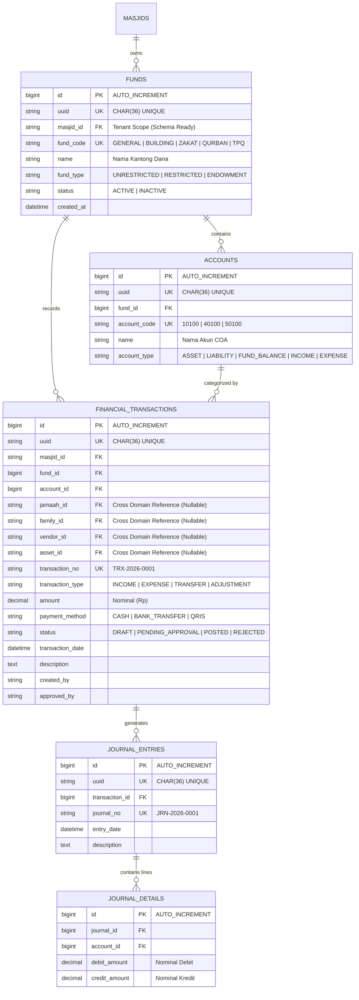

# MasjidCMS — Financial Domain Business Analysis & Architecture Specification

**Versi:** 1.1 (SAD v1.1 Architecture Alignment & Compliance Specification)  
**Status:** PROPOSED ARCHITECTURE SPECIFICATION  
**Fase:** Product Development RC1  
**Tanggal:** 27 Juli 2026  
**Penulis:** Lead Software Architect & Financial Systems Analyst  

---

## Executive Summary

Dokumen ini mendokumentasikan analisis bisnis, aturan syariah/akuntansi, struktur basis data, serta spesifikasi arsitektur untuk **Domain Keuangan (Financial Domain)** pada **MasjidCMS Product RC1**.

Dokumen ini telah diselaraskan dengan **Software Architecture Document (SAD v1.1)** untuk memastikan konsistensi strategi Primary Key, isolasi domain (*Domain Ownership*), pemisahan mesin persetujuan (*Approval Engine*), serta spesifikasi aturan bisnis dana terikat (*Enforceable Fund Rules*).

---

## 1. Business Requirement (Analisis Kebutuhan Lapangan)

Pengelolaan keuangan masjid di Indonesia memiliki karakteristik unik yang memerlukan pemisahan kantong dana (*Fund Separation*):

1. **Kas Operasional (General / Operational Fund):**
   Penerimaan infaq kotakan Jumat, infaq harian, dan donasi umum. Digunakan untuk biaya listrik, air, honor Marbot/Imam/Muadzin, kebersihan, dan pemeliharaan ringan.
2. **Dana Pembangunan (Building / Capital Fund):**
   Infaq khusus pembangunan, renovasi gedung, menara, atau pembebasan tanah.
3. **Dana ZISWAF (Zakat, Infaq, Shadaqah Terikat, Wakaf):**
   Penerimaan Zakat Fitrah, Zakat Mal, Fidyah, Infaq Terikat (Mustahik/Bansos), dan Wakaf Uang/Tanah.
4. **Dana Pengelolaan Qurban (Qurban Fund):**
   Penerimaan pendaftaran mudi, pembelian hewan, biaya operasional jagal, dan kupon distribusi.
5. **Dana Pendidikan / TPQ (Education Fund):**
   SPP santri TPQ, insentif Guru TPQ, dan pembelian alat tulis/buku modul.
6. **Dana Pelayanan Umat / Ambulans & Sosial (Social Services Fund):**
   Infaq operasional ambulans gratis, santunan anak yatim, dan bantuan pengurusan jenazah.
7. **Dana Kegiatan Ramadhan & PHBI (Special Program Fund):**
   Infaq Buka Puasa Bersama (Iftar), I'tikaf, Tarawih, serta Peringatan Hari Besar Islam.

---

## 2. Fund Accounting Strategy vs Commercial Accounting

### 2.1 Evaluasi Model Akuntansi
- **Model Akuntansi Komersial (Perusahaan):** Berfokus pada profitabilitas, laba/rugi (*Profit & Loss*), dan ekuitas pemegang saham. **Tidak cocok** untuk entitas masjid karena mengaburkan batasan peruntukan dana.
- **Model Fund Accounting (Akuntansi Dana Nirlaba Keagamaan):** Setiap *Fund* bertindak sebagai entitas pembukuan independen dengan saldo dan laporan terpisah.

### 💡 Rekomendasi Arsitektur: **FUND ACCOUNTING MODEL**
MasjidCMS menerapkan **Fund Accounting** (referensi: `docs/adr/ADR-0005-FUND-ACCOUNTING-MODEL.md`) dengan struktur relasi:
`Fund -> Account (COA) -> Transaction -> Journal Entry -> Reports`

---

## 3. Primary Key & Indexing Strategy (SAD v1.1 Alignment)

### 3.1 Evaluasi Kinerja Primary Key
Tabel transaksi keuangan (seperti `financial_transactions` dan `journal_details`) diperkirakan mengalami tingkat penyisipan data (*insert throughput*) yang tinggi.

- **Ditolak:** Penggunaan acak `UUID v4` sebagai Primary Key bertipe Clustered Index memicu fragmentasi indeks B-Tree (*B-Tree Page Splitting*) dan penurunan performa penyisipan secara drastis pada tabel besar.
- **Diadopsi (OPTION A - Recommended):** Menggunakan `BIGINT AUTO_INCREMENT` sebagai Primary Key fisik internal (Clustered Index), dikombinasikan dengan `uuid CHAR(36) UNIQUE` sebagai identifier publik eksternal.

---

## 4. Multi-Tenant Scope Strategy

- **Catatan Operasional Runtime:** `Single Masjid Runtime` (Fitur Multi-Masjid belum diaktifkan pada RC1).
- **Kesiapan Skema Basis Data (`Schema Ready, Feature Disabled`):** Seluruh tabel Keuangan (`funds`, `accounts`, `financial_transactions`, `journal_entries`) **tetap mempertahankan kolom `masjid_id`** untuk memastikan kesiapan skema jika fitur multi-masjid diaktifkan di masa mendatang.

---

## 5. Domain Ownership & Cross-Domain References

Domain Keuangan **tidak memiliki (not owner of)** entitas Jamaah, Keluarga, Vendor, atau Asset. 

Seluruh relasi ke domain luar diklasifikasikan sebagai **Cross-Domain References**:
- `jamaah_id` -> Foreign reference ke Domain Jamaah.
- `family_id` -> Foreign reference ke Domain Family.
- `vendor_id` -> Foreign reference ke Domain Vendor (System).
- `asset_id`  -> Foreign reference ke Domain Asset (sebelumnya istilah *Inventaris* disesuaikan menjadi *Asset* sesuai SAD v1.1).

> [!NOTE]
> Kepemilikan (*Ownership*) dan siklus hidup entitas tersebut berada sepenuhnya pada domain asalnya masing-masing.

---

## 6. Chart of Accounts (COA) Architecture

Klasifikasi akun pembukuan menggunakan standar penomoran 5 digit:

| Kode Akun | Kelompok Akun | Tipe / Sifat | Contoh Akun |
| :--- | :--- | :--- | :--- |
| `10000 - 19999` | **Aset (Assets)** | Debit | Kas Tunai, Bank Syariah, Piutang, Uang Muka |
| `20000 - 29999` | **Kewajiban (Liabilities)** | Kredit | Utang Operasional, Titipan Zakat Belum Disalurkan |
| `30000 - 39999` | **Saldo Dana (Fund Balances)**| Kredit | Saldo Kas Operasional, Saldo Pembangunan, Saldo ZIS |
| `40000 - 49999` | **Penerimaan (Incomes)** | Kredit | Infaq Kotak Jumat, Zakat Fitrah, Infaq TPQ |
| `50000 - 59999` | **Pengeluaran (Expenses)** | Debit | Biaya Listrik/Air, Honorarium, Santunan Yatim |

---

## 7. Financial Structure Chain

```
┌──────────────┐      ┌──────────────┐      ┌─────────────────────────┐
│     FUND     │─────►│ ACCOUNT(COA) │─────►│  FINANCIAL TRANSACTION  │
│ (Kas/Pembangunan)  │ (10100 - Kas) │      │ (Record Infaq/Expense) │
└──────────────┘      └──────────────┘      └────────────┬────────────┘
                                                         │
                                                         ▼
┌──────────────┐                            ┌─────────────────────────┐
│ FINANCIAL    │◄───────────────────────────│      JOURNAL ENTRY      │
│ REPORTS      │   (Double-Entry Posting)   │  (Debit & Credit Check) │
└──────────────┘                            └─────────────────────────┘
```

---

## 8. Transaction Types Specification

1. **Penerimaan (`INCOME`):** Transaksi masuk (Infaq Jumat, Transfer Donasi, Zakat, SPP TPQ).
2. **Pengeluaran (`EXPENSE`):** Transaksi keluar (Pembayaran Listrik, Biaya Pemeliharaan, Honor).
3. **Transfer Antar Fund (`FUND_TRANSFER`):** Pemindahan dana antar-kantong yang diperbolehkan syariat (misal: Subsidi Kas Operasional ke Dana TPQ).
4. **Adjustment (`ADJUSTMENT`):** Penyesuaian koreksi pembukuan / *Opname Kas*.
5. **Opening Balance (`OPENING_BALANCE`):** Saldo awal penyiapan pembukuan masjid.
6. **Closing Balance (`CLOSING_BALANCE`):** Penutupan buku kas bulanan / tahunan.

---

## 9. Business Rule Specification (Enforceable Fund Rules)

Aturan pembukuan dana terikat diwujudkan sebagai **Spesifikasi Aturan Bisnis yang Enforceable**:

### 9.1 Rules Matrix

| Rule ID | Name | Rule Owner | Validation Layer | Service Enforcement | Failure Behavior |
| :--- | :--- | :--- | :--- | :--- | :--- |
| `BR-FIN-01` | **Zakat Restriction** | Syariah / ZIS Domain | `FundTransferValidator` | `FundTransferService::transfer()` | Throw `BusinessRuleException("Dana Zakat dilarang ditransfer untuk Operasional/Fisik.")` |
| `BR-FIN-02` | **Wakaf Preservation** | Asset / Wakaf Domain | `FundExpenseValidator` | `FinancialExpenseService::spend()` | Throw `BusinessRuleException("Pokok Dana Wakaf dilarang dibelanjakan untuk operasional rutin.")` |
| `BR-FIN-03` | **Qurban Isolation** | Qurban Domain | `FundTransferValidator` | `FundTransferService::transfer()` | Throw `BusinessRuleException("Dana Qurban terisolasi dan dilarang dicampur dengan Kas Umum.")` |
| `BR-FIN-04` | **Restricted Deficit Rejection** | Financial Domain | `FundBalanceValidator` | `JournalPostingService::post()` | Throw `BusinessRuleException("Saldo Kantong Dana Terikat tidak boleh bernilai minus (Defisit).")` |

---

## 10. Financial Reports (Matriks Laporan Keuangan)

| Nama Laporan | Jenis Laporan | Pengguna Utama | Deskripsi & Fungsi |
| :--- | :--- | :--- | :--- |
| **Buku Kas (Cash Book)** | Harian / Realtime | Bendahara / Operator | Catatan kronologis penerimaan & pengeluaran kas tunai/bank. |
| **Buku Besar (General Ledger)**| Bulanan | Bendahara | Rincian pergerakan debit/kredit per Akun COA. |
| **Saldo per Fund** | Realtime | Ketua DKM / Jamaah | Ringkasan saldo kas aktif per kantong dana (Operasional, ZIS, DLL). |
| **Arus Kas (Cash Flow)** | Bulanan / Tahunan | Pengurus & Publik | Laporan penerimaan dan pengeluaran kas berdasarkan aktivitas. |
| **Rekap Bulanan (Monthly Summary)**| Bulanan | Jamaah / Pengurus | Laporan transparansi bulanan yang ditempel di papan pengumuman. |
| **Laporan Program Khusus** | Per Event | Panitia Program | Laporan pertanggungjawaban kegiatan (Ramadhan, Qurban, Santunan). |

---

## 11. Approval Workflow vs Reusable Approval Engine

### 11.1 Financial Approval Business Workflow
1. **Pengajuan Transaction:** Operator/Bendahara menginput transaksi pengeluaran.
2. **Kriteria Approval:** Transaksi dengan nominal melebihi ambang batas (*threshold*) memerlukan persetujuan Ketua DKM.
3. **Posting Jurnal:** Transaksi yang disetujui diubah statusnya menjadi `POSTED` dan entri jurnal dibentuk.

> [!IMPORTANT]
> **Catatan Arsitektur Reusable Approval Engine:**  
> Mesin Persetujuan (*Approval Engine*) berpotensi menjadi komponen umum (*reusable component*) yang dapat dimanfaatkan oleh domain lain (seperti Pengajuan Anggaran Qurban atau Peminjaman Asset). Pemisahan Approval Engine menjadi modul umum memerlukan **keputusan arsitektur tersendiri (Requires separate ADR)**.

---

## 12. Future Architecture Consideration

Penggunaan **EventDispatcher** untuk memicu integrasi asynchronous dan **Audit Engine** otomatis dipisahkan dari arsitektur inti finansial versi ini dan dimasukkan ke dalam **Future Architecture Consideration**:

- Transaksi keuangan versi awal berjalan secara sinkronis di dalam batas transaksi database (`UnitOfWork`).
- Integrasi Event-Driven Keuangan & Audit Trail Lanjutan **memerlukan ADR tersendiri (Requires separate ADR)**.

---

## 13. Entity Relationship Diagram (ERD Finance - SAD v1.1 Compliant)



---

## 14. Architecture Alignment Notes

| Kategori Keputusan | Status Keputusan | Detail & Catatan Arsitektur |
| :--- | :--- | :--- |
| **Fund Accounting Model** | **FINAL** | Diadopsi via `docs/adr/ADR-0005-FUND-ACCOUNTING-MODEL.md`. |
| **Primary Key Indexing** | **FINAL** | Option A (`BIGINT AUTO_INCREMENT` PK + `uuid CHAR(36)` UNIQUE). |
| **Domain References** | **FINAL** | References ke Jamaah, Family, Vendor, Asset bersifat *Cross Domain Reference*. |
| **Terminology Standard** | **FINAL** | Menggunakan istilah *Asset* (bukan *Inventaris*). |
| **Multi-Masjid Scope** | **PROPOSED** | Schema Ready (`masjid_id`), Feature Disabled, Single Masjid Runtime. |
| **Enforceable Fund Rules**| **PROPOSED** | Di-enforce pada Service Layer (`BusinessRuleException`). |
| **Reusable Approval Engine**| **NEEDS ADR** | Memerlukan ADR tersendiri jika dipisahkan dari Domain Finance. |
| **Event-Driven Finance Audit**| **NEEDS ADR** | Memerlukan ADR tersendiri untuk asynchrony & event architecture. |
