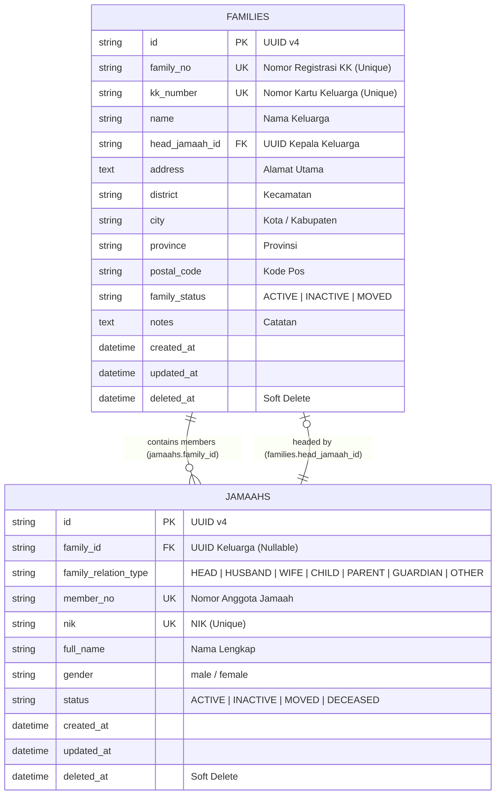
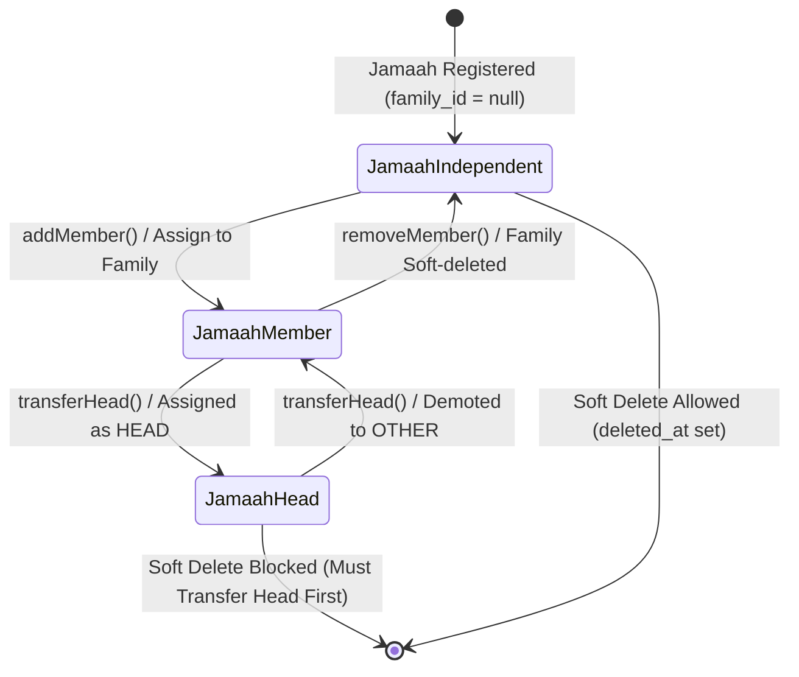
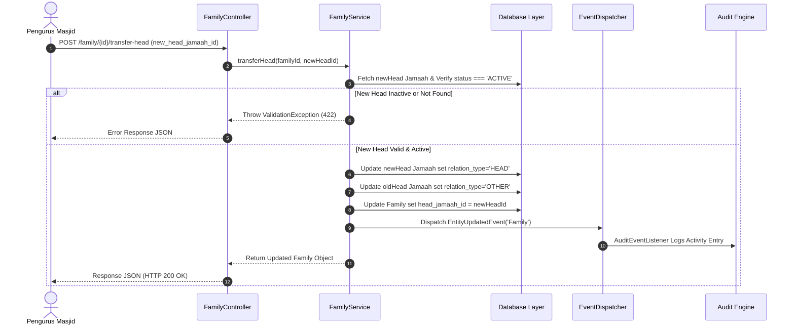

# MasjidCMS — Master Data Integration Architecture (RC1)

**Versi:** 1.0 (Integration Architecture & Specification)  
**Status:** APPROVED INTEGRATION SPECIFICATION  
**Fase:** Product Development RC1  
**Tanggal:** 27 Juli 2026  
**Penulis:** Lead Software Architect & Product Engineering Team  

---

## 1. Master Data Architecture

Master Data Integration RC1 menyatukan **Domain Jamaah** dan **Domain Keluarga (Family)** menjadi satu kesatuan sistem terintegrasi tanpa mengorbankan modulitas domain (*domain isolation*) maupun Core Platform.

```
┌─────────────────────────────────────────────────────────────────────────┐
│                        MASTER DATA LAYER RC1                            │
│                                                                         │
│   ┌───────────────────────────┐         ┌───────────────────────────┐   │
│   │       JAMAAH DOMAIN       │         │       FAMILY DOMAIN       │   │
│   │                           │         │                           │   │
│   │  - Jamaah Entity          │◄───────►│  - Family Entity          │   │
│   │  - JamaahRepository       │ 1-to-N  │  - FamilyRepository        │   │
│   │  - JamaahService          │         │  - FamilyService          │   │
│   └─────────────┬─────────────┘         └─────────────┬─────────────┘   │
└─────────────────┼─────────────────────────────────────┼─────────────────┘
                  │                                     │
                  ▼                                     ▼
┌─────────────────────────────────────────────────────────────────────────┐
│                      CORE PLATFORM SERVICES (LOCKED)                    │
│                                                                         │
│   [ Validation Engine ] ──► [ UnitOfWork / Tx ] ──► [ Audit Engine ]   │
│                                                                         │
└─────────────────────────────────────────────────────────────────────────┘
```

---

## 2. Final ER Diagram



---

## 3. Business Rules Matrix

| Komponen | Rule ID | Deskripsi Aturan Bisnis | Tindakan Sistem Jika Dilanggar |
| :--- | :--- | :--- | :--- |
| **Family** | `BR-FAM-01` | `family_no` wajib unik dan tidak boleh duplikat. | Return `422 Unprocessable Entity` (ValidationException). |
| **Family** | `BR-FAM-02` | `kk_number` bersifat nullable, namun jika diisi wajib unik. | Return `422 Unprocessable Entity`. |
| **Head Pointer**| `BR-HEAD-01` | Hanya boleh ada 1 Kepala Keluarga (`HEAD`) dalam 1 Family. | Menghentikan eksekusi & meminta menggunakan `transferHead()`. |
| **Head Pointer**| `BR-HEAD-02` | Kepala Keluarga baru pada `transferHead()` wajib berstatus `ACTIVE`. | Penolakan transfer dengan pesan error jika Jamaah `DECEASED`/`MOVED`. |
| **Delete Protection**| `BR-DEL-01` | Jamaah yang sedang menjadi Kepala Keluarga (`HEAD`) **dilarang di-soft delete**. | Throw `ValidationException` meminta transfer Head terlebih dahulu. |
| **Delete Integrity**| `BR-DEL-02` | Jika Family di-soft delete, seluruh jamaah anggotanya **tetap ada** & `family_id` di-detach (`null`). | Otomatisasi update `family_id = null` & `family_relation_type = null`. |

---

## 4. Integration Flow & Member Management

### 4.1 End-to-End Master Data Flow
1. **Create Family:** Admin membuat Keluarga baru & menunjuk Jamaah `head_jamaah_id`.
2. **Assign Member:** Admin menambahkan Istri & Anak via `addMember()`.
3. **Transfer Head:** Admin memindahkan peran Kepala Keluarga ke Istri/Anak via `transferHead()`.
4. **Move Member:** Admin memindahkan Jamaah ke KK lain via `moveMember()`.
5. **Soft Delete Safety:** Rejection saat menghapus Head Jamaah & safe detachment saat menghapus Family.

---

## 5. State Diagram



---

## 6. Sequence Diagram (Transfer Head of Family)



---

## 7. Constraint Matrix

| Atribut Integrasi | Constraints | Enforced By |
| :--- | :--- | :--- |
| `family_no` | `UNIQUE, NOT NULL` | Database Index & `FamilyService::validateCreate` |
| `kk_number` | `UNIQUE, NULLABLE` | Database Index & `FamilyService::validateCreate` |
| `jamaahs.family_id` | `FOREIGN KEY` (Logical/DB) | `FamilyService::assignMemberToFamily` |
| `head_jamaah_id` | `UUID ACTIVE JAMAAH` | `FamilyService::transferHead` |
| `deleted_at` | `SOFT DELETE TIMESTAMP` | `JamaahModel` & `FamilyModel` |

---

## 8. Known Limitations

- Integrasi Master Data RC1 mengelola integritas relasional Jamaah & Family di backend. Tampilan kartu keluarga visual / antarmuka GUI pohon silsilah keluarga diserahkan ke komponen frontend Web App.
