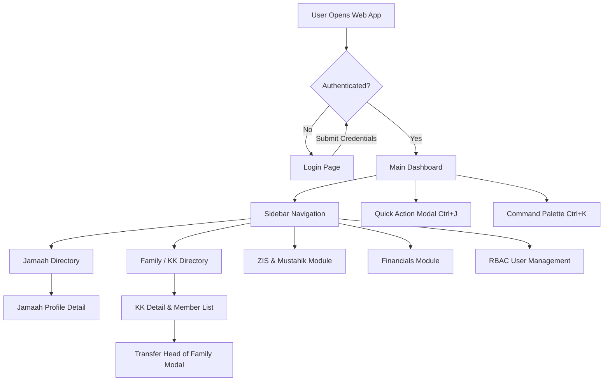

# MasjidCMS — Product UI/UX Architecture Specification

**Versi:** 1.0 (Product UI/UX Design System & Architectural Blueprint)  
**Status:** APPROVED DESIGN SPECIFICATION  
**Fase:** Product Development RC1  
**Tanggal:** 27 Juli 2026  
**Penulis:** Lead UI/UX Architect & Product Design Team  

---

## Executive Summary

Dokumen ini mendokumentasikan spesifikasi arsitektur **Antarmuka Pengguna (UI) dan Pengalaman Pengguna (UX)** untuk **MasjidCMS Product RC1**.

Rancangan antarmuka MasjidCMS mengusung estetika **Modern Premium Dashboard** yang dinamis, responsif, aman terintegrasi dengan RBAC (*Permission-Aware Navigation*), mendukung mode gelap (*Dark Mode Strategy*), serta dioptimalkan untuk perangkat mobile (*Mobile-First Responsive Layout*).

---

## 1. Information Architecture (IA)

Pohon Arsitektur Informasi MasjidCMS dikelompokkan secara logis berdasarkan fungsi manajemen operasional masjid:

```
[ MASJIDCMS PLATFORM DASHBOARD ]
  ├── 1.0 Overview & Analytics
  │     ├── 1.1 Executive Summary Dashboard
  │     ├── 1.2 Quick Metrics & Realtime Cards
  │     └── 1.3 Activity Audit Feed
  │
  ├── 2.0 Master Data Jamaah & Keluarga
  │     ├── 2.1 Direktori Jamaah (Pencarian, Filter, CRUD)
  │     ├── 2.2 Direktori Kartu Keluarga / KK (Pencarian, Transfer Head, Detach)
  │     └── 2.3 Peta Demografi Jamaah & Mustahik
  │
  ├── 3.0 Keuangan & Kas Masjid
  │     ├── 3.1 Transaksi Kas (Pemasukan & Pengeluaran)
  │     ├── 3.2 Laporan Keuangan (Jurnal, Buku Besar, Neraca)
  │     └── 3.3 Manajemen Rekening Bank & Kotak Infaq
  │
  ├── 4.0 ZIS (Zakat, Infaq, Shadaqah) & Mustahik
  │     ├── 4.1 Penerimaan Zakat Fitrah & Mal
  │     ├── 4.2 Pendataan Mustahik & Asnaf
  │     └── 4.3 Penyaluran Zakat & Bukti Kuitansi
  │
  ├── 5.0 Pengelolaan Qurban
  │     ├── 5.1 Pendaftaran Shohibul Qurban (Mudi)
  │     ├── 5.2 Penerimaan & Pendataan Hewan Qurban
  │     └── 5.3 Paket Distribusi & Kupon Daging Qurban
  │
  ├── 6.0 Inventaris & Aset Masjid
  │     ├── 6.1 Daftar Aset & Inventaris
  │     ├── 6.2 Pemeliharaan & Peminjaman Barang
  │     └── 6.3 Lokasi & Kondisi Aset
  │
  ├── 7.0 Peribadatan, Kajian & TPQ
  │     ├── 7.1 Jadwal Sholat & Piket Imam/Muadzin
  │     ├── 7.2 Jadwal Kajian & Penceramah
  │     └── 7.3 Data Santri & Pengajar TPQ
  │
  └── 8.0 Pengaturan & Keamanan
        ├── 8.1 Profil & Konfigurasi Masjid
        ├── 8.2 Manajemen Pengguna & Peran (RBAC)
        └── 8.3 Log Audit & Keamanan Sistem
```

---

## 2. Sidebar Navigation

Navigation Bar kiri (Sidebar) dirancang dengan struktur grup berjenjang (*Collapsible Sidebar Accordion*):

```
┌────────────────────────────────────────────────────────┐
│  [Logo] MasjidCMS v1.0                                 │
│  Masjid Agung Bogor  [▼ Switch Tenant]                 │
├────────────────────────────────────────────────────────┤
│  MAIN MENU                                             │
│  📊 Dashboard                                          │
│                                                        │
│  MASTER DATA                                           │
│  👥 Data Jamaah               [Badged 1,245]           │
│  🏠 Data Keluarga (KK)        [Badged 312]             │
│                                                        │
│  FINANCE & ZIS                                         │
│  💰 Kas & Keuangan            [Accordion ▼]            │
│      ├── Transaksi Cash                                │
│      └── Laporan Kas                                   │
│  🌙 Zakat & Mustahik          [Accordion ▼]            │
│      ├── Penerimaan Zakat                              │
│      └── Penyaluran Zakat                              │
│  🐄 Operasional Qurban                                 │
│                                                        │
│  ASSETS & EVENTS                                       │
│  📦 Inventaris & Aset                                  │
│  📚 Kajian & Peribadatan                               │
│  🎓 Pendidikan TPQ                                     │
│                                                        │
│  SYSTEM                                                │
│  ⚙️ Pengaturan Masjid                                  │
│  🛡️ Manajemen User & RBAC                             │
│  📜 Log Audit Sistem                                   │
└────────────────────────────────────────────────────────┘
```

---

## 3. Top Navigation (Header)

Header Navigasi Atas menyediakan kontrol cepat dan resolusi status sesi:

```
┌─────────────────────────────────────────────────────────────────────────────────────────┐
│ ☰  [🔍 Cari Jamaah, KK, atau Transaksi... (Ctrl+K)]   [⚡ Action]  [🔔 3] [🌙] [Avatar ▼] │
└─────────────────────────────────────────────────────────────────────────────────────────┘
```

- **Tenant Switcher Dropdown:** Mengizinkan Super Admin memindahkan konteks masjid aktif (`masjid_id`).
- **Global Search Input (`Ctrl+K`):** Palette pencarian cepat.
- **Quick Action Button (`⚡ Action`):** Dropdown tindakan cepat (Tambah Jamaah, Registrasi Zakat, dll).
- **Notification Center Drawer (`🔔`):** Indikator pemberitahuan.
- **Theme Toggle (`🌙` / `☀️`):** Pengalih mode gelap/terang.
- **User Profile Menu Dropdown (`Avatar ▼`):** Informasi akun aktif & tombol Logout.

---

## 4. Dashboard Layout Strategy

Layout Dashboard menggunakan **12-Column Responsive Grid System**:

```
┌─────────────────────────────────────────────────────────────────────────────────────────┐
│ TOP HEADER NAVIGATION                                                                   │
├─────────────────────────────────────────────────────────────────────────────────────────┤
│ Breadcrumb: Home / Dashboard / Overview                                                 │
├──────────────────────────┬──────────────────────────┬───────────────────┬───────────────┤
│ KPI 1: Total Jamaah      │ KPI 2: Total Keluarga    │ KPI 3: Saldo Kas  │ KPI 4: ZIS    │
│ 1,245 (↑ 12% bulan ini)  │ 312 KK                   │ Rp 145.250.000    │ Rp 28.500.000 │
├──────────────────────────┴──────────────────────────┴───────────────────┴───────────────┤
│ [CHART AREA - 8 Columns]                            │ [RECENT AUDIT FEED - 4 Columns]   │
│ Grafik Arus Kas & Zakat Fitrah                      │ - Jamaah Baru Added (10m ago)     │
│ [==================================]                │ - Head Transferred (1h ago)       │
│                                                     │ - Kas Infaq Received (3h ago)     │
├─────────────────────────────────────────────────────┴───────────────────────────────────┤
│ DATA TABLE WIDGET (12 Columns)                                                          │
│ Daftar Transaksi Terakhir & Status Verifikasi                                           │
└─────────────────────────────────────────────────────────────────────────────────────────┘
```

---

## 5. Widget Dashboard (KPI & Metrics)

Widgets dirancang berbasis modul yang dapat diatur ulang (*Modular Card Widgets*):
- **Jamaah KPI Card:** Total jamaah aktif, distribusi gender, dan persentase usia produktif.
- **Family KPI Card:** Total KK terdaftar dan indikator Kepala Keluarga.
- **Financial Balance Card:** Saldo kas utama, penerimaan infaq mingguan, dan beban operasional.
- **ZIS & Mustahik Widget:** Realisasi zakat fitrah terumpul vs target jiwa.
- **Qurban Progress Card:** Jumlah pendaftar Shohibul Qurban & status hewan qurban.

---

## 6. Quick Actions Palette

Menu Tindakan Cepat (*Quick Action Modal*) diakses via tombol `⚡ Action` atau keyboard shortcut `Ctrl+J`:

```
┌────────────────────────────────────────────────────────┐
│ ⚡ QUICK ACTION MENU                                    │
├────────────────────────────────────────────────────────┤
│ [ 👤 ] Registrasi Jamaah Baru        (Shift + J)       │
│ [ 🏠 ] Buat Kartu Keluarga Baru      (Shift + K)       │
│ [ 💰 ] Catat Transaksi Infaq/Kas     (Shift + F)       │
│ [ 🌙 ] Terima Zakat Fitrah           (Shift + Z)       │
│ [ 🐄 ] Daftar Shohibul Qurban        (Shift + Q)       │
└────────────────────────────────────────────────────────┘
```

---

## 7. Global Search (Command Palette `Ctrl+K`)

Command Palette menggunakan pencarian seketika (*Instant Asynchronous Search*) lintas entitas:

```
┌────────────────────────────────────────────────────────┐
│ 🔍 Type a command or search...               [ ESC ]   │
├────────────────────────────────────────────────────────┤
│ JAMAAH                                                 │
│   👤 H. Ahmad Dahlan — JM-2026-001 (081234567890)      │
│   👤 Hj. Siti Walidah — JM-2026-002 (081987654321)     │
│ KARTU KELUARGA                                         │
│   🏠 Keluarga H. Ahmad Dahlan — KK-3271-2026-001       │
│ ACTIONS & NAVIGATION                                   │
│   ⚙️ Buka Pengaturan Hak Akses / RBAC                   │
│   📄 Laporan Kas & Jurnal Keuangan                     │
└────────────────────────────────────────────────────────┘
```

---

## 8. Notification Center

Sistem Pemberitahuan (*Notification Center*) terbagi menjadi 3 segmen:
1. **Audit Logs:** Peringatan perubahah data sensitif (misal: Transfer Head of Family).
2. **Approval Request:** Permintaan persetujuan pengeluaran kas dari Bendahara ke Ketua DKM.
3. **System Alerts:** Peringatan kuota penyimpanan atau pembaharuan platform.

---

## 9. Dynamic Breadcrumb Trail

Breadcrumb dihasilkan secara otomatis berdasarkan hierarki rute halaman:

```
Home / Master Data / Data Jamaah / Detail Jamaah (H. Ahmad Dahlan)
```

Setiap segmen bersifat clickable untuk navigasi cepat kembali ke induk modul.

---

## 10. Permission-Aware Navigation (RBAC Integration)

Setiap item di Sidebar Navigation, Quick Actions, dan Tombol Operasi dibungkus oleh **Permission Check Guard (`hasPermission`)**:

- Jika user **tidak memiliki permission** `jamaah.read`, grup menu "Data Jamaah" **otomatis disembunyikan** dari Sidebar.
- Jika user **hanya memiliki permission `read`** tanpa `create`, tombol "+ Tambah Jamaah" di halaman data table **otomatis di-render tersembunyi**.

---

## 11. Menu per Role Matrix

| Menu Sidebar | Super Admin | Admin Masjid | Ketua DKM | Bendahara | Sekretaris | Operator | UPZ | Qurban | Jamaah | Viewer |
| :--- | :---: | :---: | :---: | :---: | :---: | :---: | :---: | :---: | :---: | :---: |
| **Dashboard Overview** | Yes | Yes | Yes | Yes | Yes | Yes | Yes | Yes | Yes | Yes |
| **Data Jamaah & KK** | Yes | Yes | Read | Read | **Full** | **Full** | Read | Read | Self | Read |
| **Kas & Keuangan** | Yes | Yes | Approve | **Full** | Read | Read | Read | Read | Read | Read |
| **Zakat & Mustahik** | Yes | Yes | Read | Read | Read | Read | **Full** | Read | Read | Read |
| **Operasional Qurban** | Yes | Yes | Read | Read | Read | Read | Read | **Full** | Read | Read |
| **Inventaris Aset** | Yes | Yes | Read | Read | Read | **Full** | Read | Read | Read | Read |
| **Pendidikan TPQ** | Yes | Yes | Read | Read | **Full** | **Full** | Read | Read | Read | Read |
| **User & RBAC Config** | Yes | Yes | Read | Read | Read | None | None | None | None | None |

---

## 12. Responsive Layout Strategy & Breakpoints

Grid System menyesuaikan layout berdasarkan ukuran layar client:

| Breakpoint Tag | Minimum Width | Target Device | Layout Behaviour |
| :--- | :--- | :--- | :--- |
| `xs` | `< 640px` | Smartphone | 1 Column, Sidebar Drawer (Off-canvas), Tables convert to Cards |
| `sm` | `≥ 640px` | Large Phone / Small Tablet | 2 Columns Grid, Compact Header |
| `md` | `≥ 768px` | Tablet Portrait | 2-3 Columns Grid, Collapsible Left Sidebar |
| `lg` | `≥ 1024px` | Laptop / Tablet Landscape | 3-4 Columns Grid, Persistent Left Sidebar |
| `xl` | `≥ 1280px` | Desktop Monitor | 4 Columns Grid, Full Detailed Cards |
| `2xl` | `≥ 1536px` | Ultra-wide Screen | Max-width Container (1536px) centered |

---

## 13. Dark Mode Strategy

Sistem Tema berbasis **CSS Custom Properties (Design Tokens)**:

```css
:root {
  --bg-primary: #f8fafc;
  --bg-surface: #ffffff;
  --text-main: #0f172a;
  --border-color: #e2e8f0;
  --brand-primary: #059669; /* Emerald Mosque Theme */
}

[data-theme="dark"] {
  --bg-primary: #0f172a;
  --bg-surface: #1e293b;
  --text-main: #f8fafc;
  --border-color: #334155;
  --brand-primary: #10b981;
}
```

- **Auto-Detection:** Mendeteksi `prefers-color-scheme: dark` dari OS client.
- **Manual Override:** Menyimpan preferensi pengguna di `localStorage.getItem('theme')`.

---

## 14. Mobile-First Strategy

- **Off-Canvas Sidebar Drawer:** Pada perangkat mobile (`< 768px`), sidebar berubah menjadi sliding drawer yang dibuka via tombol hamburger (`☰`).
- **Touch Targets:** Seluruh tombol dan link memiliki area sentuh minimal `44px x 44px`.
- **Card-View Tables:** Tabel data secara otomatis bertransformasi menjadi daftar Card ringkas pada layar seluler agar tidak terjadi *horizontal scroll* yang merusak UX.

---

## 15. Wireframes (Layout Diagrams)

### 15.1 Desktop Dashboard Wireframe

```text
┌───────────────────────────────────────────────────────────────────────────────────────────┐
│ [Logo] MasjidCMS   [🔍 Search Ctrl+K]               [⚡ Action]  [🔔 3]  [🌙]  [Avatar ▼] │
├───────────────┬───────────────────────────────────────────────────────────────────────────┤
│ OVERVIEW      │ Breadcrumb: Home / Dashboard / Overview                                   │
│ 📊 Dashboard  ├───────────────┬───────────────┬───────────────────┬───────────────────────┤
│               │ Jamaah Active │ Total KK      │ Kas Utama         │ ZIS Terkumpul         │
│ MASTER DATA   │ 1,245         │ 312           │ Rp 145.250.000    │ Rp 28.500.000         │
│ 👤 Jamaah     ├───────────────┴───────────────┴───────────────────┴───────────────────────┤
│ 🏠 Keluarga   │ GRAFIK ARUS KAS & PERTUMBUHAN JAMAAH                                      │
│               │ [══════════════════════════════════════════════════════════════════════]  │
│ FINANCE & ZIS ├───────────────────────────────────┬───────────────────────────────────────┤
│ 💰 Keuangan   │ DATA TABEL TRANSAKSI TERAKHIR     │ AKTIVITAS AUDIT LOG                   │
│ 🌙 Zakat Fitrah│ - Infaq Jumat (Rp 5.200.000)      │ - Jamaah Baru Added (10m ago)         │
│ 🐄 Qurban     │ - Penyaluran Zakat (Rp 1.500.000) │ - Head Transferred (1h ago)           │
└───────────────┴───────────────────────────────────┴───────────────────────────────────────┘
```

### 15.2 Mobile View Layout Wireframe

```text
┌──────────────────────────────────────┐
│ ☰  MasjidCMS         [🔔]  [Avatar] │
├──────────────────────────────────────┤
│ 🔍 Cari Jamaah, KK, Zakat...        │
├──────────────────────────────────────┤
│ 📊 Overview Jamaah & Kas             │
│ ┌──────────────────────────────────┐ │
│ │ Total Jamaah: 1,245              │ │
│ │ Saldo Kas: Rp 145.250.000        │ │
│ └──────────────────────────────────┘ │
├──────────────────────────────────────┤
│ 👤 DAFTAR JAMAAH TERAKHIR            │
│ ┌──────────────────────────────────┐ │
│ │ H. Ahmad Dahlan                  │ │
│ │ JM-2026-001 • Kota Bogor          │ │
│ │ Status: ACTIVE                   │ │
│ └──────────────────────────────────┘ │
│ ┌──────────────────────────────────┐ │
│ │ Hj. Siti Walidah                 │ │
│ │ JM-2026-002 • Kota Bogor          │ │
│ │ Status: ACTIVE                   │ │
│ └──────────────────────────────────┘ │
└──────────────────────────────────────┘
```

---

## 16. Primary User Journeys

### Journey 1: Pendaftaran Jamaah Baru & Penetapan Kepala Keluarga

```
[ Pengurus Input Data ] ──► Registrasi Jamaah (POST /jamaah)
                                     │
                                     ▼
                        Opsi: Buat KK Baru? (POST /family)
                                     │
                                     ▼
                       Set Jamaah sebagai HEAD (family_relation_type='HEAD')
                                     │
                                     ▼
                       Tampilkan Halaman Detail KK dengan Anggota Sub-Tabel
```

---

## 17. Navigation Flowchart



---

## 18. Architectural Recommendation & Go / No Go Decision

```text
====================================================================
           PRODUCT UI/UX ARCHITECTURE REVIEW BOARD                  
====================================================================

Design Review Status       : APPROVED
Permission-Aware Nav       : Integrated with RBAC Foundation (TASK-026)
Responsiveness & Theme     : CSS Tokens + Mobile First Strategy
Go / No Go Decision        : GO TO FRONTEND / VIEW IMPLEMENTATION

====================================================================
```

### Pernyataan Rekomendasi:
Spesifikasi Arsitektur UI/UX Produk **MasjidCMS Product RC1** dinyatakan **SANGAT MATANG, AMAN, DAN DIREKOMENDASIKAN (GO)** untuk dijadikan panduan implementasi antarmuka pada fase berikutnya.
