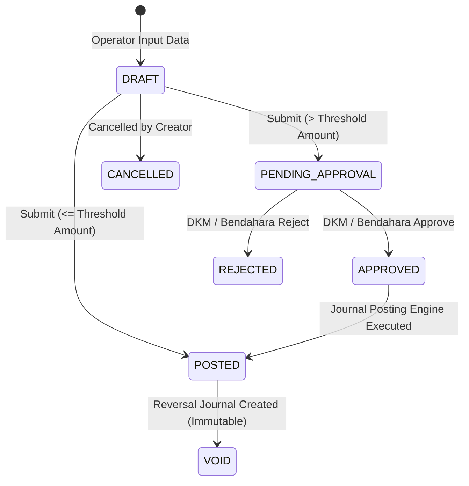

# ADR-0006: Financial Posting Lifecycle and Balance Architecture

- **Status:** Accepted
- **Tanggal:** 27 Juli 2026
- **Pengambil Keputusan:** Lead Software Architect & Financial Engineering Team

---

## 1. Financial Posting Lifecycle

Siklus hidup transaksi keuangan pada MasjidCMS dikelola secara deklaratif melalui State Transition Machine yang ketat untuk menjamin integritas pembukuan:



### 1.1 State Transition Rules & Immutability

| State | Allowed Transitions | Transition Actor | Journal Created? | Balance Changed? | Editable? |
| :--- | :--- | :--- | :---: | :---: | :---: |
| `DRAFT` | `PENDING_APPROVAL`, `POSTED`, `CANCELLED` | Operator / Bendahara | No | No | **Yes** |
| `PENDING_APPROVAL` | `APPROVED`, `REJECTED`, `CANCELLED` | Ketua DKM / Bendahara | No | No | No |
| `APPROVED` | `POSTED` | Posting Engine / System | No | No | No |
| `REJECTED` | `DRAFT`, `CANCELLED` | Operator | No | No | **Yes (as new draft)** |
| `CANCELLED` | None (Terminal) | Creator | No | No | No (Immutable) |
| **`POSTED`** | `VOID` (via Reversal) | Posting Engine / Admin | **YES** | **YES** | **NO (IMMUTABLE)** |
| `VOID` | None (Terminal) | System / Reversal Engine | **YES (Opposite)** | **YES (Adjusted)** | No (Immutable) |

### 1.2 Immutability Rules
- **Aturan Ketat 1:** Transaksi berstatus **`POSTED` atau `VOID` HAKIKI IMMUTABLE (Dilarang diedit atau dihapus dari basis data)**.
- **Aturan Ketat 2:** Jurnal ganda (*Journal Entry & Details*) **DILARANG DIHAPUS (`DELETE`)**. Setiap koreksi transaksi wajib melalui pembentukan Jurnal Pembalik (*Reversal Journal Entry*).

---

## 2. Double-Entry Posting Mechanics

Setiap transaksi finansial ter-posting memicu rantai alur pembukuan ganda (*Double-Entry Chain*):

```
Transaction ──► Journal Entry (Header) ──► Journal Details (Lines) ──► General Ledger ──► Balance
```

### 2.1 Exception Analysis (1 Transaction vs Journal Entries)

Secara standar, **1 Transaction = 1 Journal Entry (Header) + 2/More Journal Details (Lines)**. Pengecualian diatur sebagai berikut:

| Jenis Transaksi | Jumlah Journal Header | Mekanisme Debit / Kredit Journal Lines |
| :--- | :---: | :--- |
| **Penerimaan (`INCOME`)** | 1 Header | **Debit:** Akun Kas/Bank (`10100`) <br> **Kredit:** Akun Penerimaan COA (`40000`) |
| **Pengeluaran (`EXPENSE`)**| 1 Header | **Debit:** Akun Pengeluaran COA (`50000`) <br> **Kredit:** Akun Kas/Bank (`10100`) |
| **Transfer Antar Fund (`FUND_TRANSFER`)**| 2 Headers (Dual Journal) | **Header 1 (Sumber):** Debit Saldo Inter-Fund / Kredit Kas Fund A <br> **Header 2 (Tujuan):** Debit Kas Fund B / Kredit Saldo Inter-Fund |
| **Adjustment (`ADJUSTMENT`)** | 1 Header | **Debit/Kredit:** Akun Kas vs Akun Selisih Kas Opname |
| **Reversal (`VOID`)** | 1 Header Pembalik | **Opposite Journal Lines:** Membalik posisi Debit & Kredit dari Jurnal Original |

---

## 3. Balance Strategy (Hybrid Balance Model)

Dua pendekatan arsitektur saldo dievaluasi:
- **Option A (Derived Balance):** Saldo dihitung secara *realtime* dengan menjumlahkan `SUM(debit) - SUM(credit)` dari tabel jurnal.  
  *Kelemahan:* Kueri lambat pada tabel transaksi besar.
- **Option B (Cached Balance):** Saldo disimpan di kolom `financial_accounts.balance` dan di-update saat transaksi di-post.  
  *Kelemahan:* Berisiko ketidakseimbangan jika terjadi *unlocked concurrent writes*.

### 💡 Rekomendasi RC1: **HYBRID BALANCE MODEL**
MasjidCMS menerapkan **Hybrid Balance Model**:
1. **Cached Balance for Fast Reads:** Kolom `financial_accounts.balance` menyimpan saldo berjalan yang di-update secara atomik saat status transaksi berubah menjadi `POSTED`.
2. **Derived Balance for Double-Entry Audit Verification:** Fungsi `FinancialAuditService::verifyBalanceIntegrity()` secara periodik menghitung ulang `SUM(Journal Details)` untuk memverifikasi keabsahan saldo cached.

---

## 4. Concurrency & Locking Controls

Untuk mencegah masalah *double posting*, *lost updates*, *dirty reads*, dan *duplicate journals* saat dua pengguna meng-post transaksi secara bersamaan:

1. **Pessimistic Row Locking (`SELECT ... FOR UPDATE`):**  
   Saat `PostingEngine` mengeksekusi update saldo pada `financial_accounts`, baris saldo dikunci menggunakan `SELECT balance FROM financial_accounts WHERE id = ? FOR UPDATE`.
2. **Database Transaction Boundary (`UnitOfWork`):**  
   Seluruh operasi (Update Status Transaksi + Insert Journal Header + Insert Journal Lines + Update Cached Balance) dibungkus di dalam **1 Transaksi Basis Data Atomik**.
3. **Idempotency Key & Unique Constraint:**  
   Kolom `transaction_no` dan `journal_no` memiliki indeks `UNIQUE` untuk menghentikan duplikasi submit.

---

## 5. Reversal & Immutability Strategy

Perbaikan kesalahan transaksi yang sudah ter-posting dilakukan tanpa pernah menghapus baris basis data:

1. **Skenario Batam/Batal Total (`VOID`):**  
   Sistem mengubah status transaksi original dari `POSTED` menjadi `VOID`, kemudian membentuk **Reversal Journal Entry** yang berisi baris posisi terbalik (Debit menjadi Kredit, Kredit menjadi Debit).
2. **Skenario Koreksi Nominal (`CORRECTION`):**  
   Transaksi salah di-`VOID`, kemudian pengguna membuat draft transaksi baru dengan nominal yang benar.
3. **Audit Trail Preservation:**  
   Laporan keuangan mempertahankan riwayat transaksi original dan transaksi pembalik untuk transparansi audit.

---

## 6. Numbering Strategy & Reset Cycle

Nomor dokumen dibuat dengan format terstruktur:

| Jenis Dokumen | Prefix Format | Contoh Nomor | Siklus Reset Nomor |
| :--- | :--- | :--- | :--- |
| **Financial Transaction** | `TRX-{YYYY}{MM}-{SEQUENCE}` | `TRX-202607-00001` | Reset Setiap Bulan (`Monthly Reset`) |
| **Journal Entry** | `JRN-{YYYY}{MM}-{SEQUENCE}` | `JRN-202607-00001` | Reset Setiap Bulan (`Monthly Reset`) |
| **Approval Log** | `APR-{YYYY}{MM}-{SEQUENCE}` | `APR-202607-00001` | Reset Setiap Bulan (`Monthly Reset`) |

- **Alasan Monthly Reset:** Memudahkan audit bulanan, kerapihan penomoran kuitansi fisik/cetak, serta menjaga nomor urut tetap pendek dan mudah dibaca pengurus masjid.

---

## 7. Failure Recovery & Atomic Posting

Jika eksekusi posting gagal di tengah jalan (misal: koneksi terputus saat insert Journal Lines):

1. **Atomic Rollback:** Seluruh perubahan di-rollback secara otomatis oleh `TransactionManager`. Status transaksi tetap pada posisi awal (`APPROVED` / `DRAFT`).
2. **Zero Partial Posting:** Tidak akan pernah ada jurnal setengah-tercatat atau saldo ter-update sebagian.
3. **Idempotent Retry:** Transaksi yang gagal di-post dapat dicoba ulang (*retry*) secara aman tanpa risiko duplikasi.

---

## 8. Implementation Impact

| Komponen Sistem | Dampak Implementasi & Kesiapan |
| :--- | :--- |
| **Database Migrations** | Menambahkan enum status `CANCELLED` & `VOID` pada `financial_transactions`. |
| **Posting Engine** | Membangun `JournalPostingService` yang mengeksekusi double-entry posting di dalam `UnitOfWork`. |
| **Service Layer** | Mengimplementasikan `ReversalService` untuk membentuk jurnal pembalik. |
| **Financial Reports** | Kueri laporan kas menyaring transaksi berstatus `POSTED` (mengabaikan `DRAFT` & `VOID`). |
| **Approval Workflow** | Mengunci transaksi berstatus `PENDING_APPROVAL` dari perubahan data. |

---

## 9. Decision Summary & Sign-off

- **Posting Lifecycle:** `DRAFT` -> `PENDING_APPROVAL` -> `APPROVED` -> `POSTED` -> `VOID` (**LOCKED**).
- **Journal Immutability:** Strict NO DELETE. Reversal via opposite entries (**LOCKED**).
- **Balance Model:** Hybrid Balance Model (**LOCKED**).
- **Concurrency Control:** `SELECT ... FOR UPDATE` + Unique Constraints (**LOCKED**).
- **Numbering Format:** `TRX-YYYYMM-XXXXX` & `JRN-YYYYMM-XXXXX` (**LOCKED**).
