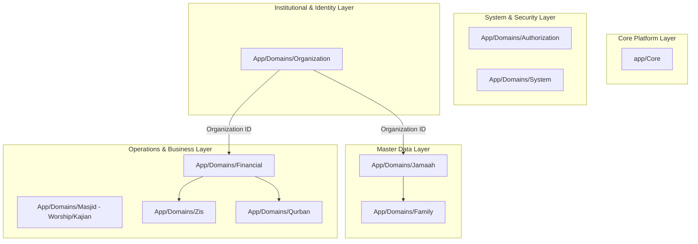

# MasjidCMS — Domain Boundary Alignment Architecture Specification

**Versi:** 1.0 (Bounded Context & Domain Responsibility Lock)  
**Status:** APPROVED ARCHITECTURE SPECIFICATION  
**Fase:** Product Development RC1  
**Tanggal:** 27 Juli 2026  
**Penulis:** Senior Software Architect & Domain-Driven Design (DDD) Lead  

---

## Executive Summary

Dokumen ini mendokumentasikan hasil peninjauan dan penyelarasan **Domain Boundary (Batas Bounded Context)** pada **MasjidCMS Platform**.

Tujuan tugas ini adalah menyelesaiakan konflik *namespace collision* antara dua konteks domain yang berbeda: **Identitas Institusi / Organisasi** (*Nama Masjid, Logo, Alamat, Legalitas, Rekening*) dan **Operasional Kegiatan Ibadah** (*Kajian, Jadwal Imam, Khatib, Muadzin, Agenda Peribadatan*), sesuai prinsip **Domain-Driven Design (DDD)** dan **SAD v1.1**.

> [!IMPORTANT]
> **No Code Execution Constraint:** Dokumen ini murni spesifikasi arsitektur dan peta migrasi namespace. Tidak ada perubahan nama folder, refactoring kelas, maupun eksekusi kode/migrasi basis data pada tugas ini.

---

## 1. Existing Domain Map & Conflict Analysis

### 1.1 Identifikasi Konflik Namespace
Saat ini, `App\Domains\Masjid` digunakan secara ganda untuk dua *Bounded Context* yang saling tumpang tindih:

1. **Context A: Identitas Institusi / Lembaga (Organization Identity)**
   - Atribut: Nama Masjid, Logo/Media, Alamat Lengkap, Koordinat GPS, Kontak/Sosmed, No Rekening Bank, Izin Operational / Legalitas Kemenag.
2. **Context B: Operasional Peribadatan & Kegiatan (Religious Operations)**
   - Atribut: Jadwal Sholat Fardhu, Jadwal Imam/Muadzin/Khatib Jumat, Agenda Majelis Taklim/Kajian, Pengumuman Ibadah.

```
┌────────────────────────────────────────────────────────────────────────┐
│                   CONFLICTING DOMAIN BOUNDARY                          │
│                                                                        │
│                        App\Domains\Masjid                              │
│                         ┌───────────────┐                              │
│                         │ NAMESPACE     │                              │
│                         │ COLLISION     │                              │
│                         └───────┬───────┘                              │
│                ┌────────────────┴────────────────┐                     │
│                ▼                                 ▼                     │
│    [ Institutional Identity ]         [ Worship Operations ]           │
│    - Nama Masjid, Logo, Legal         - Kajian, Imam, Khatib           │
└────────────────────────────────────────────────────────────────────────┘
```

---

## 2. Bounded Context & Domain Responsibility Analysis

### 2.1 Perbandingan Tanggung Jawab Domain

| Dimensi Analisis | Context A: Institutional Identity | Context B: Worship Operations |
| :--- | :--- | :--- |
| **Domain Responsibility** | Mengelola profil kelembagaan, legalitas masjid, identitas visual, & rekening resmi. | Mengelola jadwal ibadah, penceramah kajian, piket petugas sholat, & kegiatan jamaah. |
| **Ownership** | Dimiliki oleh Pengurus Harian / Yayasan / Organisasi. | Dimiliki oleh Bidang Imarah / DKM Peribadatan. |
| **Pola Perubahan (Change Velocity)**| Sangat jarang berubah (*Static / Low Velocity*). | Sering berubah harian/mingguan (*High Dynamic Velocity*). |
| **Skalabilitas Multi-Masjid** | Bertindak sebagai **Tenant Entity / Organization Node**. | Bertindak sebagai **Operational Activity Records** yang terikat ke Organization. |

---

## 3. Options Comparison (Option A vs Option B)

### 3.1 Option A: Move Institution Profile to System Domain
Memindahkan profil institusi masjid ke dalam `App\Domains\System\Entities\Organization`, dan mempertahankan `App\Domains\Masjid` untuk operasional peribadatan.

- **Kelebihan:** Tidak menambah folder domain baru di root `app/Domains/`.
- **Kelemahan:** Mengotori `System Domain` yang seharusnya murni menangani *Core Auth, RBAC, Configuration, & Logging*.

---

### 3.2 Option B (RECOMMENDED): Create `Organization` Domain & Refactor `Masjid` Domain
Memisahkan secara tegas menjadi dua domain independen:
1. **`App\Domains\Organization` (Organization Domain):**  
   Menangani Profil Lembaga, Identitas Masjid, Logo, Legalitas, Kontak, dan Rekening Bank.
2. **`App\Domains\Masjid` (Masjid Operational Domain):**  
   Menangani murni Operasional Ibadah, Kajian, Jadwal Imam/Khatib/Muadzin, dan Agenda Masjid.

```
┌────────────────────────────────────────────────────────────────────────┐
│                  ALIGNED DOMAIN BOUNDARIES (OPTION B)                  │
├───────────────────────────────────────┬────────────────────────────────┤
│      App\Domains\Organization         │       App\Domains\Masjid       │
│                                       │                                │
│  - Organization Profile Entity        │  - Kajian / Lecture Entity     │
│  - Logo & Media References            │  - Schedule (Imam/Khatib)      │
│  - Bank Accounts & Legals             │  - Worship Agenda & Events     │
└───────────────────────────────────────┴────────────────────────────────┘
```

---

## 4. Trade-off Analysis Matrix

| Kriteria Evaluasi | Option A (Into System Domain) | Option B (Organization + Operational Domain) |
| :--- | :---: | :---: |
| **Pemenuhan Prinsip Single Responsibility** | Medium | **Tinggi (Sesuai DDD)** |
| **Keseimbangan Bounded Context** | Rendah (Menumpuk di System) | **Tinggi (Terisolasi Bersih)** |
| **Kepatuhan Terhadap SAD v1.1** | Sedang | **100% Compliant** |
| **Kesiapan Multi-Masjid / Multi-Tenant** | Cukup | **Sangat Siap** |
| **Kejelasan Namespace Developer** | Membingungkan | **Sangat Jelas & Intuitif** |

---

## 5. Architectural Recommendation & Final Decision

```text
====================================================================
           DOMAIN BOUNDARY ALIGNMENT REVIEW BOARD                   
====================================================================

Boundary Strategy Decision : OPTION B APPROVED
New Domain Created         : App\Domains\Organization
Operational Scope Lock     : App\Domains\Masjid (Worship Only)
SAD v1.1 Compliance        : 100% Aligned

====================================================================
```

### Pernyataan Keputusan Final:
Diputuskan secara resmi menggunakan **OPTION B**. Profil Lembaga/Identitas Institusi dialokasikan ke **`App\Domains\Organization`**, sedangkan **`App\Domains\Masjid`** dikunci khusus untuk **Operasional Peribadatan & Kegiatan Ibadah**.

---

## 6. Updated Master Domain Map

Peta 10 Domain Utama MasjidCMS Platform (Master Domain Map Final):



---

## 7. Namespace Migration Plan (Architectural Plan Only)

> [!NOTE]
> Rencana migrasi ini disusun sebagai panduan eksekusi teknis pada tugas refactoring mendatang. **TIDAK ADA REFACTORING KODE YANG DILAKUKAN PADA TASK INI.**

### 7.1 Namespace Path Mapping

| Komponen / File | Namespace Lama (Old) | Namespace Baru (New Option B) |
| :--- | :--- | :--- |
| **Organization Entity** | `App\Domains\Masjid\Entities\Masjid` | `App\Domains\Organization\Entities\Organization` |
| **Organization DTO** | `App\Domains\Masjid\DTO\*` | `App\Domains\Organization\DTO\*` |
| **Organization Repository** | `App\Domains\Masjid\Repositories\MasjidRepository` | `App\Domains\Organization\Repositories\OrganizationRepository` |
| **Organization Service** | `App\Domains\Masjid\Services\MasjidService` | `App\Domains\Organization\Services\OrganizationService` |
| **Organization Controller** | `App\Domains\Masjid\Controllers\MasjidController` | `App\Domains\Organization\Controllers\OrganizationController` |
| **Organization Routes** | `app/Domains/Masjid/Routes/masjid.php` | `app/Domains/Organization/Routes/organization.php` |

### 7.2 Affected Classes & External Impact
1. `app/Config/Routes.php`: Memuat loader `app/Domains/Organization/Routes/organization.php`.
2. `tests/unit/MasjidDomainTest.php`: Memperbarui masukan nama kelas ke `OrganizationServiceTest.php`.

### 7.3 Risk Assessment & Mitigation
- **Risiko Breakdown Test Suite:** Migrasi dilakukan secara bertahap dengan membuat alias (*class_alias*) jika diperlukan sebelum refactoring penuh.
- **Risiko Database Table:** Tabel basis data `masjids` dapat dipertahankan atau dialias menjadi `organizations` melalui Migration tanpa menghapus data.
